<div align="center">


<br>


**[What it does](#what-it-does) · [How it works](#how-it-works) · [The models](#the-models) · [Results](#results) · [Quickstart](#quickstart) · [Decisions](#decisions-worth-knowing) · [Docs](docs/README.md)**

</div>

---

## What it does

Everyone has photographed a document and got back something tilted, dim, shadowed and barely
readable. Apps like CamScanner fix that by finding the page, flattening it, and enhancing it into
something scanner-like. This repository builds that machinery — **two convolutional networks,
designed and trained from nothing**, with no pre-trained weights, no imported architectures and no
third-party augmentation libraries.

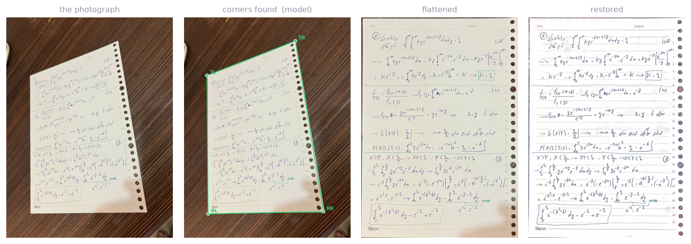

<p align="center"><em>One real photograph, start to finish. No human input: the detector finds the page, the
chain flattens it, the enhancement network restores it.</em></p>

```bash
scandar scan --input photo.jpg --output scan.png --scanner outputs/runs/corner_heat_e2e/best.pt
```

<table>
<tr>
<td width="33%" valign="top">

### 🖼 Enhancement network

An encoder–decoder with skip connections that maps a degraded, rectified page to a clean, evenly lit
scan. Trained on 256×256 patches, restores a whole page fully-convolutionally in blended tiles.

**+11.4 dB PSNR** over the do-nothing baseline.

</td>
<td width="33%" valign="top">

### 📐 Corner detector, twice

Finds the four page corners in a raw photo — built **twice**, as direct coordinate regression and as
heatmap regression, so the experiments decide which formulation wins rather than the author.

**1.06 px** at 256², heatmaps by 3×.

</td>
<td width="33%" valign="top">

### 🔗 End-to-end scanner

The two composed — detect → warp → enhance — with the warp rebuilt in torch so the enhancement loss
backpropagates all the way to the predicted corners.

**Differentiable end to end.**

</td>
</tr>
</table>

### The demo

`python app/demo.py` opens a Gradio app: pick which model or chain to run, drop in a photo, get the
corners, the flattened page and the finished scan, with a download button and a line saying which
path found the corners.

<div align="center">

</div>

---

## How it works

### The whole chain

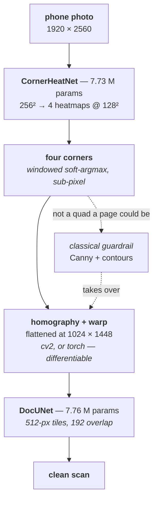

### No training image was ever annotated

This is the idea the whole project rests on. Clean scans are perspective-warped onto random
backgrounds and put through a degradation pipeline built only from OpenCV primitives. **The four
points chosen for the warp *are* the corner labels**, and because the homography is known, warping
the degraded photo back gives a pixel-perfect *(degraded, clean)* training pair. The label generator
and the data generator are the same function — so the training set is unlimited and costs nothing to
label.

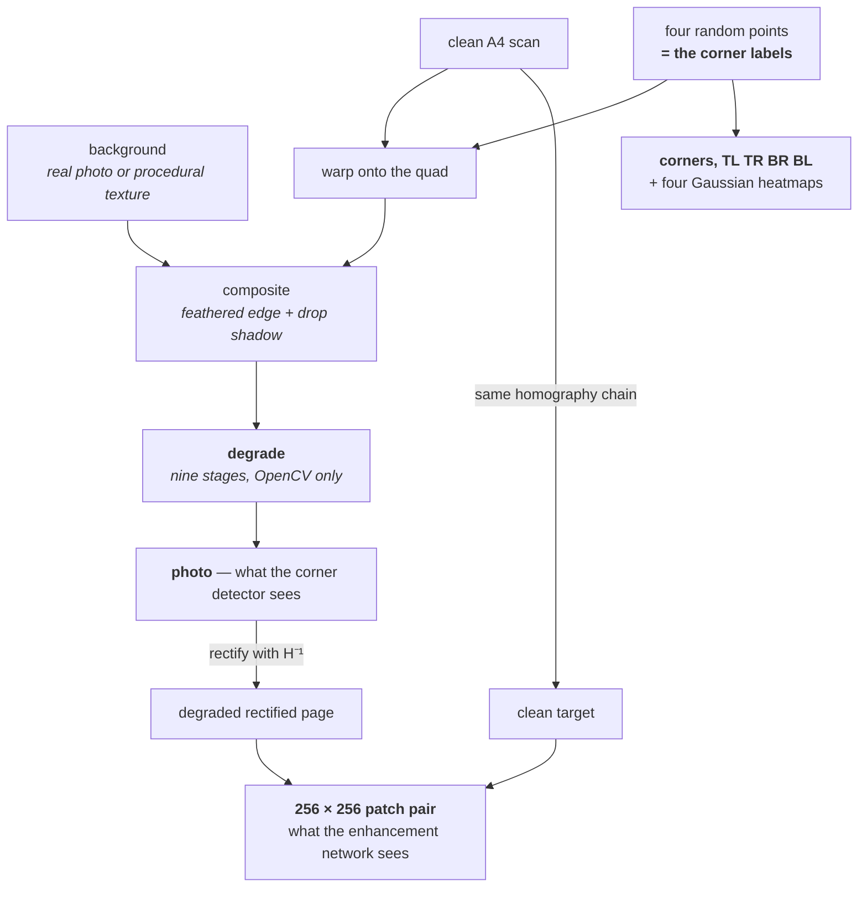

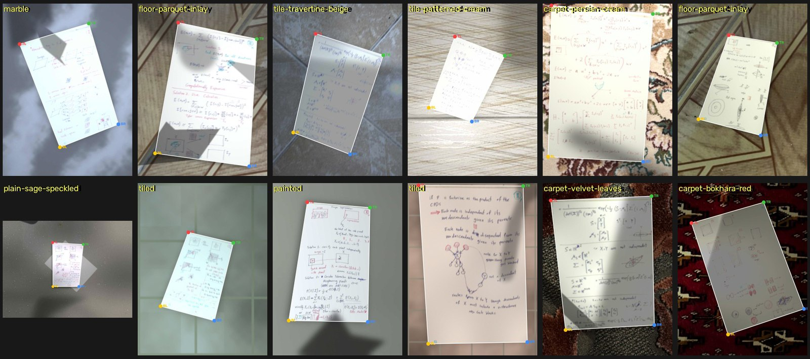

<p align="center"><em>Generated samples. Every one carries exact corner labels and a perfectly aligned clean
target, because the generator chose where the page went.</em></p>

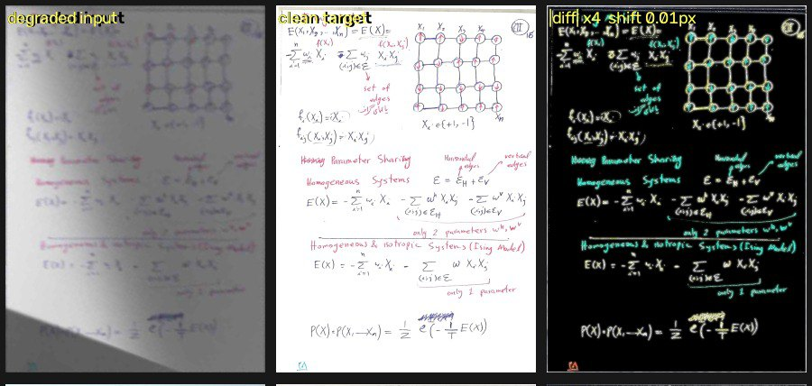

<p align="center"><em>One training pair, and the difference between the two. Only intensity differs — the
<b>positional</b> agreement is what has to be exact, and a sanity check measures it with phase correlation
every run: <b>0.01 px</b>.</em></p>

### The degradation pipeline

Nine stages, built from OpenCV and NumPy only *(brief §4)* — the brief forbids third-party
augmentation libraries, so there is no albumentations here. The pipeline works in **uint8**: point
operations collapse into a `cv2.LUT` and multiplicative ones into `cv2.multiply`, which took one
sample from 450 ms to 140 ms, and a phone stores 8 bits anyway.

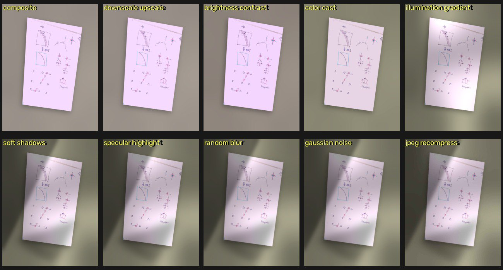

<p align="center"><em>The composite, then the nine stages one at a time: resolution loss · brightness and contrast ·
colour cast · illumination gradient · soft shadows · specular highlight · blur · sensor noise · JPEG artefacts.</em></p>

### Does it look real?

The brief asks for that comparison by name *(brief §4.4)*. Real photographs on the top row,
generated composites on the bottom:

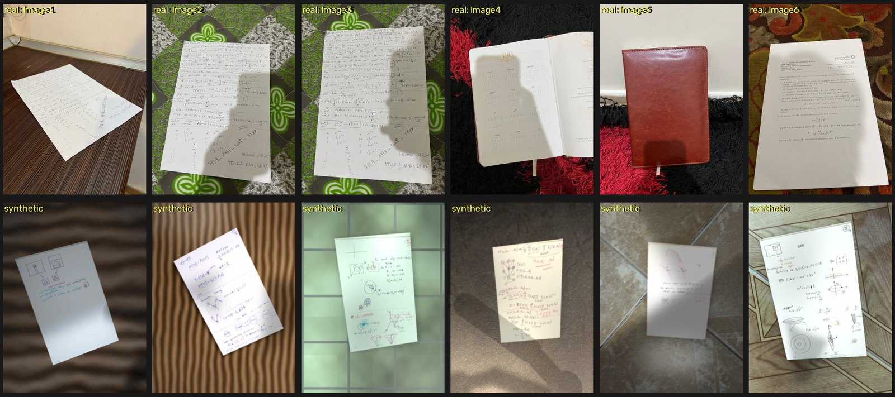

The generated ones are not indistinguishable — real paper curls, real notebooks are bound, real
covers are leather. Those are exactly the cases the failure analysis is about, and the corner
detector's samples deliberately include tinted stock, curled pages and a distractor sheet because of
them.

---

## The models

Everything lives in `src/scandar/model.py`, which the brief names explicitly. Every model declares an
`output_kind`, and the trainer, the evaluator and the inference pipelines all dispatch on it — so
adding a model is one class and one registry entry rather than an edit in four files.

| Model | Params | In → out | Loss | Trained | Result |
| :--- | ---: | :--- | :--- | :--- | :--- |
| **`DocUNet`** — enhancement | 7.76 M | 3×256² patch → 3×256² image | `L1 + 0.5·(1−MS-SSIM) + 0.25·Sobel` | 20 ep × 400 steps, batch 16, ≈2 h | **26.67 dB** / 0.953 SSIM |
| **`CornerHeatNet`** — detector B | 7.73 M | 3×256² photo → 4 heatmaps @128² | pixel-wise MSE on the maps | 20 ep × 150 steps, ≈2.2 h | **1.06 px** @256 |
| **`CornerRegNet`** — detector A | 10.75 M | 3×256² photo → 8 coordinates | L1 on the coordinates | 20 ep × 150 steps, ≈2.2 h | 3.16 px @256 |
| **`EndToEndScanner`** — bonus | 7.73 M trainable | photo → clean scan | the enhancement loss, through the warp | 5 ep, 83 min | 19.01 dB from a raw photo |

All four trained on one **RTX 3060 laptop GPU (6 GB)**, mixed precision, and interchangeably on
Colab — nothing hard-codes a device, a batch size or a path.

<details>
<summary><b>DocUNet</b> — why an encoder at all, when the output is the same size as the input</summary>

<br>

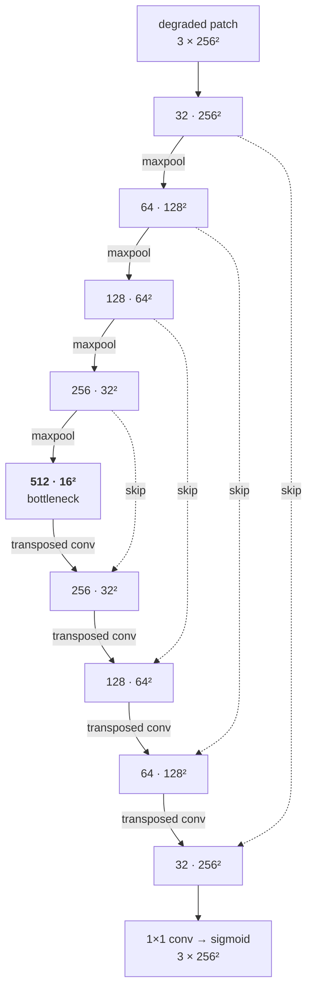

Every box is **(Conv 3×3 → BatchNorm → ReLU) × 2**, with no bias, because the normalisation would
subtract it straight back out.

**The defects are not local.** Whether a dark patch is a shadow or a smudge of ink is not answerable
from a 3×3 neighbourhood — you have to see a large part of the page at once. Four halvings put a 3×3
kernel at the bottleneck in view of roughly a quarter of the patch, which is the scale a shadow
lives at.

**The skips matter more here than in most segmentation work.** A pen stroke is two or three pixels
wide; sixteen-fold downsampling leaves *nothing* of it. The skips hand each decoder stage the
encoder's map at its own resolution, so fine detail never has to survive the bottleneck — only the
context does. `configs/enhance_no_skips.yaml` trains the identical network without them, so the
report can show that rather than assert it.

Measured receptive field: **189×189** — 86 px of context per side, which is why the inference tiles
overlap by 192 and not by 64.

</details>

<details>
<summary><b>CornerRegNet</b> and <b>CornerHeatNet</b> — the same problem, two formulations</summary>

<br>

**A — direct coordinate regression** *(`CornerRegNet`, 10.75 M)*

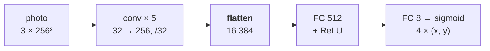

**B — heatmap regression** *(`CornerHeatNet`, 7.73 M)*

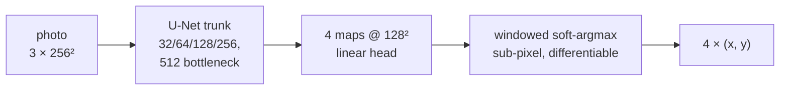

The one decision worth defending in **A** is the *flatten*. Global average pooling — the reflex after
an encoder — answers "is there a corner-like thing in this image", which is a classification
question. A coordinate is made of *where* the activation fired, and pooling is precisely the
operation that throws that away. The cost is 8.4 M weights in one fully connected layer, four fifths
of the model.

**B** keeps the problem spatial: each corner gets its own map, the target is a Gaussian of σ 3, and
the coordinate comes back out through a soft-argmax so extraction is sub-pixel and differentiable.

**The extraction was worth 6×, and nearly went unnoticed.** A *global* soft-argmax scored the same
weights at 6.83 px against 1.06 windowed: a linear head's background is small positive noise, and
over 16 384 cells that outweighs the blob, so the centre of mass reports something near the middle
of the frame. The tell was PCK being *exactly* 0.000 below 1% of the diagonal on every split at
every epoch — a floor, not a slope. There is now one `model.corners_from_output` and the trainer,
the evaluator and the pipeline all call it.

</details>

<details>
<summary><b>EndToEndScanner</b> — how a homography gets a gradient</summary>

<br>

The chain to differentiate is `photo → CornerHeatNet → soft-argmax → homography → grid_sample →
DocUNet → enhancement loss`. The warp is **hand-written in torch**, not imported: `homography_from_points`
solves the 8×8 system with `torch.linalg.solve` and matches `cv2.getPerspectiveTransform` to 1e-8,
and `warp_perspective` reproduces `cv2.warpPerspective` to **0.1 of a grey level** on a real sample.
Both are asserted in the tests, because every training pair in the project came out of the cv2 side
and a twin that samples half a pixel elsewhere would train the detector to correct for it.

Three things make it work: `align_corners=True` (the pixel-index convention), fp32 with autocast
disabled (an 8×8 solve and `grid_sample`'s grid gradient are exactly where fp16 falls over), and the
enhancer frozen in **two** places — `requires_grad=False` *and* held in eval, because a frozen
submodule left in train mode still drifts its BatchNorm statistics.

The demonstrable artefact is a test that backpropagates the enhancement loss to the predicted corners
and asserts the gradient is finite and non-zero. A sanity check prints it every run:
`|dL/dcorners| 9.476e-02`.

</details>

---

## Results

Every number below is written by `evaluate.py` into [`reports/tables/`](reports/tables/) and copied
here; nothing is hand-measured. The evaluation buckets are frozen to disk with a fixed seed, 200
pages each, with source scans **and** background surfaces disjoint across train, validation and test.

### Enhancement network

Whole pages rectified at 1024×1448, restored through the same tiled pipeline that runs at inference.
The baseline columns are the degraded input scored against the same clean targets, before any
enhancement — the line the model has to clear to be worth its parameters.

| Split | PSNR (dB) | SSIM | baseline PSNR | baseline SSIM | gain |
| :--- | ---: | ---: | ---: | ---: | ---: |
| Training | 26.81 ± 2.98 | 0.9528 | 14.70 | 0.8466 | **+12.12 dB** |
| Validation | 26.71 ± 2.55 | 0.9519 | 15.03 | 0.8542 | **+11.68 dB** |
| Test | **26.67 ± 2.54** | **0.9533** | 15.30 | 0.8489 | **+11.36 dB** |

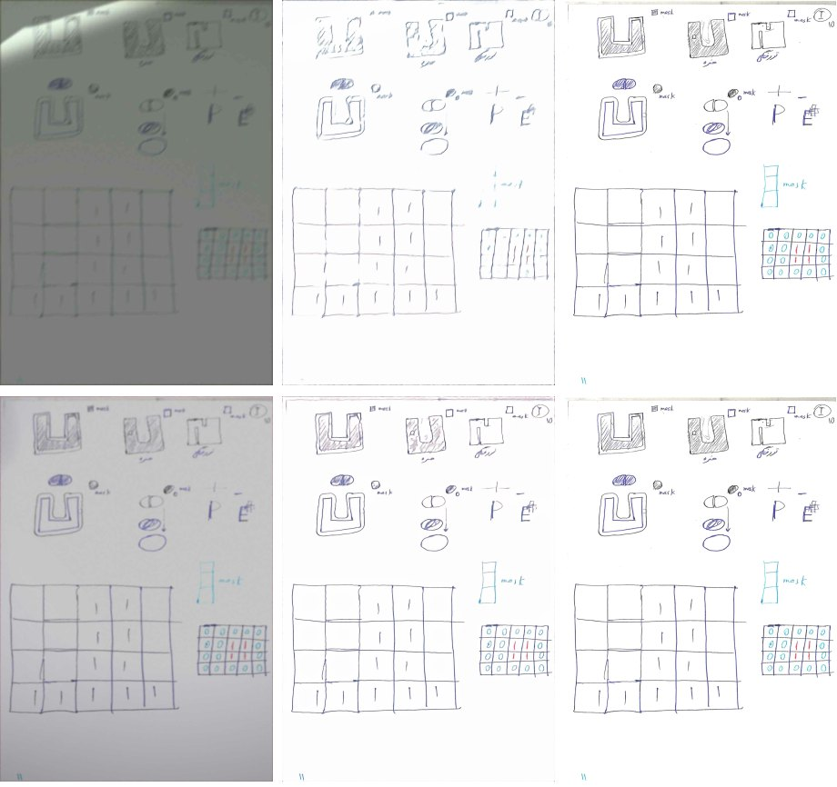

<p align="center"><em>Test pages — degraded input, ours, the clean target. Shadows, colour casts and illumination
gradients are gone; the handwriting survives.</em></p>

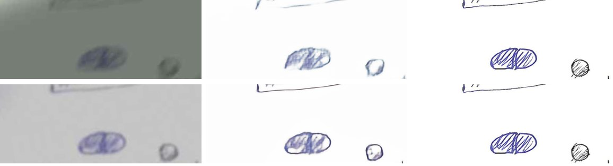

<p align="center"><em>The same three columns, zoomed to stroke level — where legibility actually lives.</em></p>

**The training-to-test gap is 0.14 dB.** For practical purposes there is no overfitting at all —
final training loss 0.0423 against 0.0467 on validation, with the validation curve still flat rather
than turning upwards at the end of the schedule. That is what an unlimited synthetic
generator buys: the model never sees the same sample twice, so there is nothing to memorise. It also
means the ceiling here is capacity and data *realism*, not regularisation — a prediction the dropout
study later gets to test.

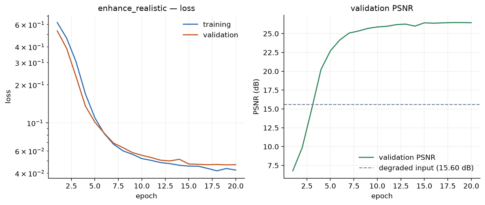

<details>
<summary>The finding that mattered most was in the <i>data</i>, not the model</summary>

<br>

The first trained model produced confident, contrasty strokes in the wrong *shape* — "joint
distribution" came back as "geint delehelition". It was inventing letterforms rather than restoring
them, and the reason was geometric. Measured as a share of the clean target's edge energy:

| | kept |
| :--- | ---: |
| the degraded input, first generator | 21% |
| the *undegraded* composite | 41% — so the warp alone cost 59% |
| a real rectified phone photo | 109% |

A 1152×1536 canvas with the page at 0.42–0.90 of its height renders the page at 645–1382 px tall,
while the training pair is rectified to 1448. **Every sample was being upsampled into its own
target**, by up to 2.2×, before a single degradation ran — so the target contained strokes the input
never had, and the only way to score well on that task is to hallucinate plausible ink. On top of
that, `downscale` started at 2.0, so nothing in the training set was ever sharp.

The fix was a canvas the size of the real photos (1920×2560) and a downscale range starting at 1.0,
which is what `configs/enhance_realistic.yaml` is. It lifts the input's retained edge energy from a
median of 21% to 37%, and it is the difference between output that looks restored and output that
looks invented. It also costs 2.2× the generation time and **invalidates every number measured
before it** — the generator changed, so the frozen buckets were rebuilt and the earlier runs are not
comparable with the table above. That is why the headline model here is `enhance_realistic` and not
the first baseline.

</details>

### Corner detection — heatmaps win

The same problem solved twice, trained on identical samples with identical schedules, and scored in
the detector's own 256×256 input space. The classical baseline is Canny + `findContours` +
`approxPolyDP` on the identical input.

| Detector | corner error (px @256) | % of diagonal | PCK@2% | quad IoU |
| :--- | ---: | ---: | ---: | ---: |
| **heatmap regression** | **1.06 ± 2.44** | **0.29%** | **0.955** | **0.9830** |
| direct coordinate regression | 3.16 ± 3.02 | 0.87% | 0.830 | 0.9577 |
| *classical baseline* | *41.66* | *11.51%* | *0.485* | *0.6582* |

<table>
<tr>
<td width="52%" valign="top">
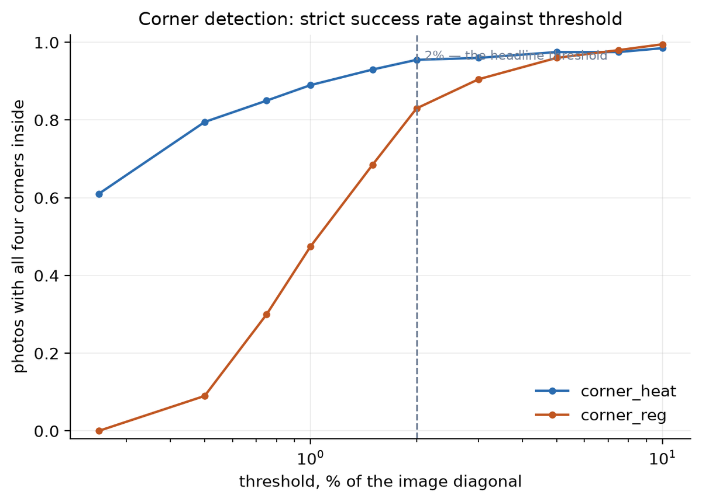
</td>
<td width="48%" valign="top">

**Heatmap regression wins by three times**, and wins at *every* threshold on the PCK curve, so the
verdict does not depend on where the threshold was drawn. The gap is widest at tight thresholds and
closes at loose ones: the two formulations are equally *reliable* at finding the page and not
remotely equally *precise* at placing its corners — which is exactly what keeping the problem
spatial is supposed to buy.

The prediction in [`reports/PREDICTIONS.md`](reports/PREDICTIONS.md) — committed to git before either
model had taken a training step — got the winner and the direction right, understated the margin,
under-rated *both* models' accuracy, and was outright wrong about how each would fail. It is scored
line by line in [the corner-detection notes](docs/corner-detection.md).

</td>
</tr>
</table>

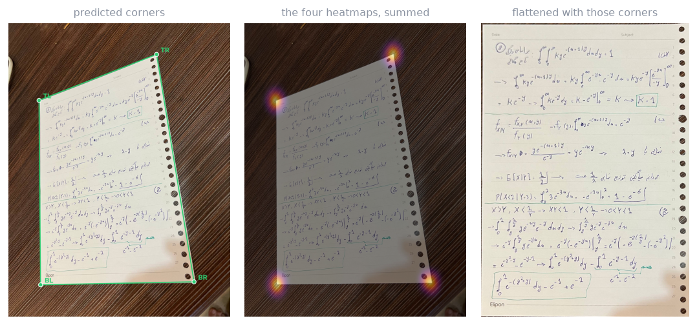

<p align="center"><em>The middle panel is the most informative failure diagnostic in the project: a corner that is
wrong because the map is <b>diffuse</b> is a model that does not know, and one that is wrong because the map has
<b>two peaks</b> is a model that found the wrong page. Those want opposite fixes.</em></p>

### Real photographs, and CamScanner as the reference

Both networks trained purely on synthetic composites, then scored on photographs neither has seen
anything like — 16 hand-labelled real photos for the corner detector, five with a CamScanner
reference scan for the enhancement network *(brief §3.3, §5)*:

| | synthetic test | real photos |
| :--- | ---: | ---: |
| corner error, % of diagonal | 0.29% | **0.34%** |
| corner PCK@2% | 0.955 | **1.000** |

**The synthetic-to-real gap this project worried about from the start is close to zero for the corner
detector**, once both numbers are read as a percentage of the image diagonal rather than compared in
raw pixels. Fifteen of sixteen photos went straight to the neural path; one fell to the classical
guardrail.

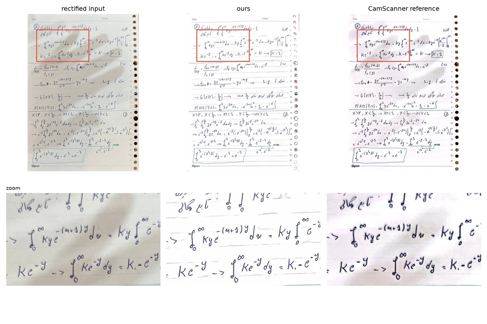

| Readability, 5 photos with a reference scan | rectified input | **ours** | CamScanner |
| :--- | ---: | ---: | ---: |
| Tesseract mean word confidence | 41.1 | **42.5** | 41.2 |

On readability our output is not distinguishable from the commercial app by Tesseract's own
confidence — it wins on three of the five photos and loses narrowly on two. The one place CamScanner
clearly wins is character error rate on the single printed document with a transcript (0.173 against
our 0.285): its aggressive whitening and sharpening is exactly what an OCR engine's character
segmentation wants on dense printed text, a case this project's training distribution — handwritten
lecture notes, mostly — does not emphasise. Full tables and the failure case are in
[the write-up](docs/real-photos-evaluation.md).

### The end-to-end scanner — the bonus, and what it bought

A phone photo in, a clean scan out, with nobody clicking anything *(brief §7)*. All 200 synthetic
test photos, the same chain before and after fine-tuning the detector through the differentiable
warp:

| | assembled | fine-tuned end to end |
| :--- | ---: | ---: |
| corner error (px @256) | 0.68 ± 0.54 | **0.66 ± 0.56** |
| scan PSNR, detected corners | 18.97 dB | **19.01 dB** |
| scan PSNR, true corners | 26.70 dB | 26.70 dB |
| degraded input | 15.30 dB | 15.30 dB |

**The fine-tune works and buys nothing, which was the prediction.** Corner error improves on 130 of
200 photos — real by a sign test, p ≈ 10⁻⁵ — and amounts to 2.4% of an error already smaller than a
pixel. The gradient reaching the corners is photometric, Lucas-Kanade style through `grid_sample`'s
spatial term, and the detector was already deep inside the basin. On the *harder* corner bucket the
fine-tuned detector is a hair worse (1.10 px against 1.06), so `corner_heat` stays the shipped model
and the fine-tune stands as the demonstration it was built to be.

The 7.7 dB between the two right-hand columns is what the detection step costs — and it is a **floor
rather than a slope**: correlation between corner error and PSNR cost over fifty photos is **0.09**.
PSNR against text punishes sub-pixel misregistration immediately and then stops caring how large it
is. That is a property of the metric, not of the scanner.

### Dropout — a null result, and one surprise

Every model retrained with dropout as its only change *(brief §6)*, compared at the same epoch of the
same schedule so the comparison is controlled rather than merely available:

| Model | metric | baseline | with dropout | change |
| :--- | :--- | ---: | ---: | ---: |
| enhancement network | validation PSNR | 25.35 dB | 25.42 dB | +0.07 |
| coordinate regressor | validation corner error | 4.56 px | 5.66 px | **−1.11** |

**Dropout buys nothing here, and that is the correct answer rather than a disappointing one.** The
train-to-test gaps before any dropout were 0.14 dB, 0.27 px and −0.06 px — there was no overfitting
for a regulariser to remove.

The surprise is *which* model lost. The prediction named the coordinate regressor as most likely to
benefit — its fully connected head is the one genuinely over-parameterised map in the project — and
it is the arm that clearly degraded. Over-parameterised turned out not to mean over-fitting: dropout
there injects noise straight into a low-dimensional continuous estimate with no redundancy to absorb
it, while the same rate at a U-Net bottleneck is shrugged off. Full scoring in
[the study](docs/dropout-study.md).

### Where it still fails

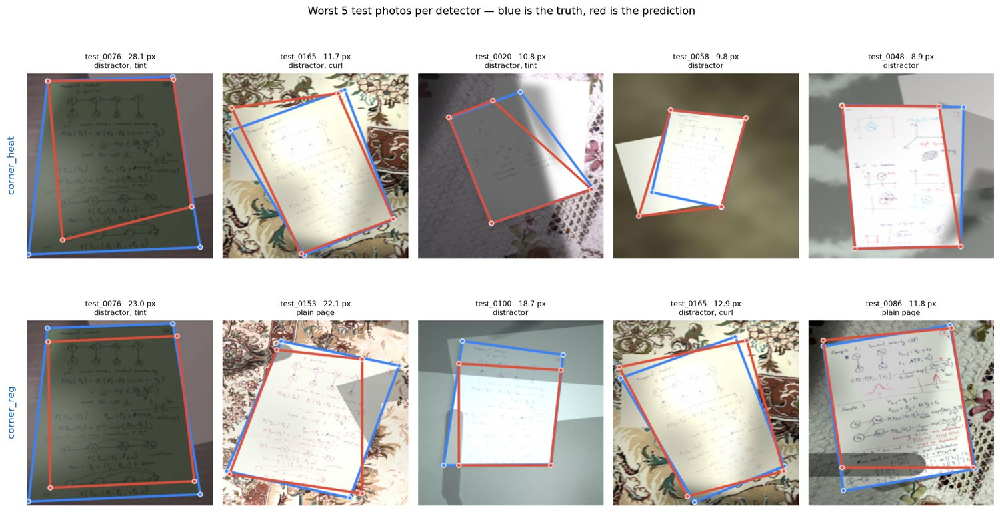

**A second sheet of paper in frame is the dominant failure mode.** Distractor sheets appear in 20% of
test photos and account for 80% of the heatmap detector's worst ten. For the enhancement network the
failures are inputs where the information was destroyed at capture — a blown-out white wash or a
crushed shadow. Layout is reconstructed; text is not, because it was never recorded.

---

## Gallery

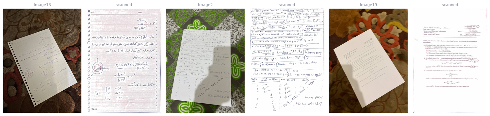

<p align="center"><em>Patterned carpet, a hard photographer shadow, a page at a steep angle — three real photos, and
what came out. Nothing was clicked.</em></p>

---

## Quickstart

```bash
git clone https://github.com/SepehrGhr/ScanDar.git && cd ScanDar
conda env create -f environment.yml && conda activate scandar
pip install -e ".[dev]"
```

**Prepare and verify**

```bash
python scripts/prepare_data.py      # cache the scans, write the split manifest
python scripts/freeze_eval_sets.py  # frozen synthetic evaluation sets, one per task
python scripts/preview_synth.py     # render generated samples to look at
python scripts/sanity_checks.py     # 42 checks: environment, data, models, loop
pytest                              # 272 unit tests
```

**Train and score**

```bash
python train.py    --config configs/enhance.yaml       # the enhancement network
python train.py    --config configs/corner_heat.yaml   # the heatmap detector
python evaluate.py --config configs/enhance.yaml       # PSNR/SSIM vs the do-nothing baseline

python train.py --config configs/enhance.yaml --set train.epochs=20 run.name=quick
```

Every run is a config file, never an edited constant; `--set key.path=value` overrides any leaf, and
a killed run resumes from `last.pt` with its epoch, step and RNG state intact.

**Run it on your own photo**

```bash
# the whole scanner, no human input
scandar scan --input my_photo.jpg --output scan.png \
    --detector outputs/runs/corner_heat/best.pt \
    --enhancer outputs/runs/enhance_realistic/best.pt

# a folder of them
python scripts/detect_batch.py  --input my_photos/          # corners, overlays, flattened pages
python scripts/enhance_batch.py --input my_photos/ --detect # photo in, clean scan out

# click the four corners yourself instead
python scripts/enhance_photo.py --input my_photo.jpg

# the demo app
python app/demo.py
```

The flattening step is not optional. The enhancement network was trained on rectified pages and
nothing else, so given a whole photo it will earnestly try to turn the desk and the wall into paper
too.

Training on Colab instead of locally: run `notebooks/00_colab_bootstrap.ipynb`. It points
`SCANDAR_DATA` and `SCANDAR_OUT` at Drive, and everything else runs unchanged — including a
wall-clock guard (`--set train.max_hours=N`) that stops cleanly, and a resume that picks up the
epoch, the step and the RNG state.

<details>
<summary>The full CLI</summary>

<br>

```
scandar prepare-data   cache the scans and write data/splits.json
scandar freeze-eval    write the frozen synthetic evaluation sets
scandar sanity         verify the data, the layout and the environment
scandar train          train a model from a config
scandar evaluate       score a trained model
scandar enhance        restore an already-rectified page
scandar detect         find the four page corners in a raw photo
scandar scan           photo in, clean scan out (bonus)
```

`make help` lists the same things as Make targets.

</details>

---

## Repository layout

```
configs/      experiment configs; every run is a file, never an edited constant
data/         scans, real photos, backgrounds, annotations   (see data/README.md)
docs/         how each part works, without reading the code   (see docs/README.md)
src/scandar/  the package
scripts/      prepare_data · freeze_eval_sets · preview_synth · sanity_checks · detect_batch ·
              enhance_batch · enhance_photo · evaluate_real · make_figures · compare_detectors …
app/          the Gradio demo
notebooks/    Colab bootstrap
tests/        272 unit tests
reports/      figures, tables and the predictions committed before the runs
assets/       the pictures this README shows  (scripts/make_readme_assets.py regenerates them)
```

The assignment brief names three files specifically; here is where they are:

| Brief | File |
| :--- | :--- |
| "implemented … in the `model.py` file" | [`src/scandar/model.py`](src/scandar/model.py) |
| "the implementation will be contained in `train.py`" | [`src/scandar/train.py`](src/scandar/train.py), runnable from the root as `python train.py` |
| "implement the evaluation step in the `evaluate.py` file" | [`src/scandar/evaluate.py`](src/scandar/evaluate.py), runnable as `python evaluate.py` |

[`docs/`](docs/README.md) explains the machinery in prose, for a reader who will not open the source:
the [conventions](docs/conventions.md) everything rests on, the
[synthetic generator](docs/synthetic-generator.md), the
[degradation pipeline](docs/degradation-pipeline.md), the
[datasets and splits](docs/datasets-and-splits.md),
[the enhancement network](docs/enhancement-network.md),
[corner detection](docs/corner-detection.md), the
[end-to-end scanner](docs/end-to-end-scanner.md), the
[dropout study](docs/dropout-study.md), the
[real-photo evaluation](docs/real-photos-evaluation.md) and
[running on Colab](docs/running-on-colab.md).

---

## Decisions worth knowing

**The enhancement network trains on patches, not whole pages.** An A4 page squeezed into 256×256
turns a pen stroke into less than one pixel, and no loss function recovers that. Instead the network
trains on 256×256 crops of pages rectified at 1024×1448 and — being fully convolutional — restores a
whole page at full resolution at inference, in overlapping tiles.

**Patch size is not page resolution.** Other implementations feed the whole page in at 256² or 512²,
where doubling the patch doubles the text resolution. Here `rect_size` sets the text resolution and
the patch only sets the window onto it, so a bigger patch adds context, never detail — and the
measured receptive field (189 px) already fits inside 256. Left as an experiment
(`configs/enhance_patch512.yaml`) rather than an argument.

**MSE is not the loss.** Squared error is minimised by the conditional mean, so wherever the network
is unsure exactly where a stroke edge falls, the cheapest answer is to average over every plausible
position — a smear. The loss is `L1 + 0.5·(1 − MS-SSIM) + 0.25·Sobel-L1`: L1 commits to an answer
instead of hedging, MS-SSIM scores structure at five scales, and the gradient term puts the penalty
on the stroke edges. Every term is hand-implemented and the weights live in the config, so the
ablation is four files that differ by four numbers.

**Split by source scan, not by generated sample.** Two degraded versions of the same page must never
land on opposite sides, or the test score stops measuring generalisation. 50 scans → 40/5/5, and the
background photos are split the same way so a surface seen in training never reappears in evaluation.

**Validation and test sets are frozen to disk.** The dataset invents a fresh sample on every
`__getitem__`, so a naive implementation would score every epoch on different images and the
validation curve would measure the dice as much as the model. A frozen *train* bucket exists too:
the generator never repeats a sample, so the brief's "Training" row can only mean the training
*distribution*.

**The page is composited, not pasted.** Its mask is feathered and it casts a soft shadow. Without
those, the page meets the background at a perfectly clean one-pixel step that no camera produces —
and a corner detector will happily learn to find *that* instead of learning what a page looks like.

**The two tasks are trained on deliberately different worlds.** The corner detector also sees
coloured and dark page stock, a second sheet underneath, and pages that will not lie flat. The
enhancement network sees none of them, because its target *is* the clean scan, and a tinted input
paired with a flat white target would ask it to invent a colour correction it was never shown how to
derive. The code strips those options for the enhancement task *structurally*, so a shared config
cannot switch them on by accident.

**The corner pipeline has a classical guardrail.** If the network returns four points that are not a
quadrilateral a page could be, a Canny + `findContours` + `approxPolyDP` detector takes over, and the
result says which path ran. The grade is decided live on photographs nobody has seen, and a
degenerate quad turned into a homography smears the page across the output. The two detectors fail on
different things, so they rarely fail together.

**The real photos are never trained on, and never degraded.** They arrive degraded by reality. They
are the only preview of what the graders will hand the model on presentation day.

<details>
<summary>Six more, for the reader who wants the sharp edges</summary>

<br>

**Two pixel conventions, kept apart deliberately.** Homographies work on pixel *indices* (a `W×H`
image's corners are `(0,0)…(W-1,H-1)`, which is what `warpPerspective` samples). Normalised corners
use `(x+0.5)/W`, because `cv2.resize` maps the continuous extent and only that form is exactly
resize-invariant. Alignment between a training pair now measures 0.01–0.03 px, and a sanity check
holds it there — using phase correlation, corrected for the estimator's *own* bias, because
`cv2.phaseCorrelate` reports 0.5 px for some image shapes against themselves.

**The composite uses premultiplied alpha.** `warpPerspective` already multiplies the page by its own
coverage, so colour and coverage are blurred with the same kernel and the result is *added*, never
multiplied by alpha a second time — which would put a dark one-pixel outline around every page.

**`persistent_workers=False` is mandatory, not a default.** `dataset.set_epoch()` is a parent-side
mutation that never reaches an already-forked worker, so persistent workers would replay one epoch's
samples for the whole run.

**Corner order is TL, TR, BR, BL everywhere**, images are RGB uint8 HWC throughout, and determinism
comes from a *stable* hash — never Python's builtin `hash`, which is salted per process, so frozen
sets would drift between runs.

**The first version of every model carries no regularisation** — no dropout, no weight decay — so the
dropout study later isolates the one variable it is about.

**Inference tile overlap is 192, not 64.** At 64 a pixel mid-blend sat 32 px from both tiles' edges,
inside the 86 px context radius of both, so the cross-fade averaged two answers at exactly the place
each was least sure of.

</details>

---

## Status

Built incrementally; this table is kept honest.

| Component | State |
| :--- | :--- |
| Project layout, configuration, splits, sanity checks | **done** — 272 tests, 42 checks |
| Synthetic generator, degradation pipeline, datasets, frozen evaluation sets | **done** — six frozen buckets of 200 |
| Enhancement network: architecture, loss, trainer, evaluation, inference | **done — trained, +11.4 dB PSNR on test** |
| Corner detection: both networks, both losses, metrics, the §5.1 pipeline | **done — both trained, heatmaps win by 3×** |
| Real-photo study: corners against Roboflow labels, OCR against CamScanner | **done** — [the study](docs/real-photos-evaluation.md) |
| Dropout study *(brief §6)* | **done on the synthetic half — a null result, written up** — [the study](docs/dropout-study.md) |
| End-to-end scanner *(bonus)* | **done — chained, differentiable, fine-tuned, scored** — [how it works](docs/end-to-end-scanner.md) |
| Demo app | **done** — `python app/demo.py`, six selectable models and chains |
| Loss and architecture ablations | configs written; the controlled comparison still to run |
| Figures and the written report | curves, PCK, failure galleries and real-photo panels exist; the report does not |

## Data

50 clean A4 scans, 19 real phone photos, 20 background surfaces, and six frozen synthetic evaluation
buckets of 200 samples each. The real photos are deliberately varied — carpet, wood, marble and a red
table; hard photographer shadows; angles and distances — and include cases the synthetic pipeline
does not model well: a bound notebook, an open two-page spread, a dark printed card. That is where
the failure analysis comes from.

Full provenance, and the rules about what may be trained on, are in
[`data/README.md`](data/README.md). Image files are not tracked by git; the layout, the annotations
and the split manifest are.

## Credits

Course project for a Convolutional Neural Networks course, directed by Arshia Akbari Alagha. Clean
document scans provided by the teaching staff; real photos, corner annotations and background images
by the author.

Licensed under the [MIT License](LICENSE).
