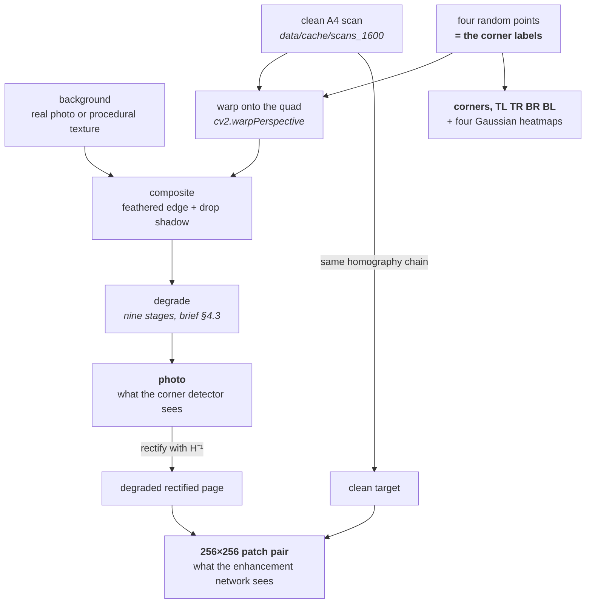

# How ScanDar works

These notes explain the machinery without asking you to read it. Each page covers one part of the
project: what it is for, how it does its job, and which decisions were deliberate.

| | |
|---|---|
| [Conventions](conventions.md) | The invariants everything else depends on: corner order, two coordinate systems, image types, determinism. **Read this first** — most of the other pages assume it. |
| [The synthetic generator](synthetic-generator.md) | How a clean scan becomes a labelled photo of a page on a desk, and how the training pairs are derived from it. |
| [The degradation pipeline](degradation-pipeline.md) | The nine stages that turn a clean composite into something that looks like a phone photo, built from OpenCV primitives only. |
| [Datasets, splits and frozen sets](datasets-and-splits.md) | What a training loop actually receives, how the data is split, and why validation and test are written to disk. |

Not yet built: the models, the losses and metrics, the training loop, evaluation, the inference
pipelines and the end-to-end scanner. The status table in the [top-level README](../README.md) is kept
honest.

## The idea in one picture

The project never annotates a training image. Four points are *chosen*, a scan is warped onto them,
and those four points are the corner labels. Because the homography is known, the degraded photo can
be warped back to produce a perfectly aligned (degraded, clean) pair. One function generates the data
and the labels together.



The two mandatory tasks are trained and evaluated independently — the corner detector on `photo` and
`corners`, the enhancement network on the patch pair — and are only chained together in the bonus
scanner *(brief §1.3)*.

## Where the code lives

| Module | Job |
|---|---|
| `src/scandar/io.py` | Every path in the project, and the single place BGR becomes RGB |
| `src/scandar/config.py` | YAML with `_base_` inheritance and `--set key.path=value` overrides |
| `src/scandar/seed.py` | `rng_for(*keys)` — a generator derived from a *stable* hash, so samples reproduce |
| `src/scandar/device.py` | Device selection, mixed precision, worker count |
| `src/scandar/prepare.py` | The scan cache, the split manifest, `ScanBank`, writing the frozen eval sets |
| `src/scandar/geometry.py` | Corner ordering, homographies, quad validity and overlap, resizing labels with images |
| `src/scandar/degrade.py` | The degradation pipeline |
| `src/scandar/backgrounds.py` | Real background photos and five procedural textures |
| `src/scandar/synth.py` | Placing the page and compositing it — `compose_sample` |
| `src/scandar/datasets.py` | The PyTorch datasets and their tensor contracts |
| `src/scandar/checks.py` | The sanity checks |

Scripts are thin and call into the package:

```bash
python scripts/prepare_data.py      # cache the scans, write data/splits.json
python scripts/freeze_eval_sets.py  # generate the frozen synthetic val/test sets
python scripts/preview_synth.py     # render samples into outputs/previews to look at
python scripts/sanity_checks.py     # verify the environment, the data and the generator
```

## Where to start reading the code

`synth.compose_sample` is the centre of the project — a hundred lines that produce one training
sample, calling into `geometry`, `backgrounds` and `degrade` in turn. Everything above it is dataset
plumbing and everything below it is OpenCV.
