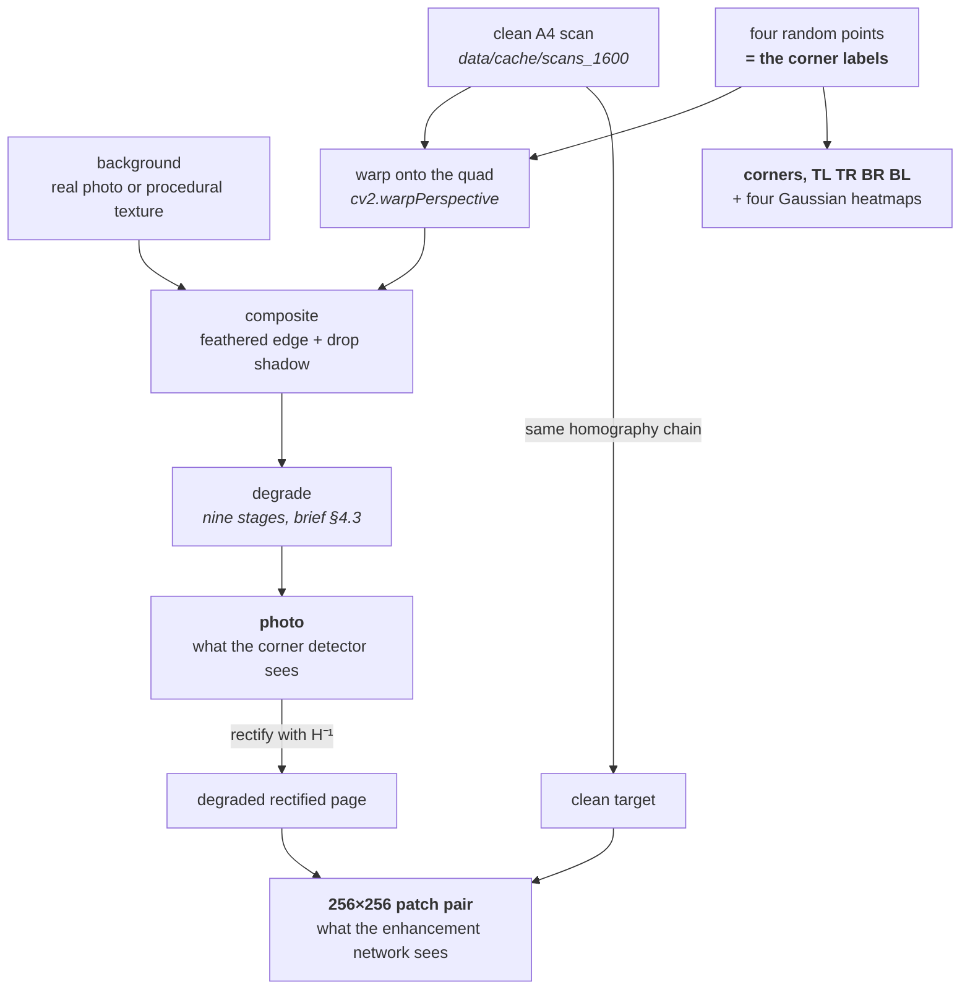

# How ScanDar works

These notes explain the machinery without asking you to read it. Each page covers one part of the
project: what it is for, how it does its job, and which decisions were deliberate.

| | |
|---|---|
| [Conventions](conventions.md) | The invariants everything else depends on: corner order, two coordinate systems, image types, determinism. **Read this first** — most of the other pages assume it. |
| [The synthetic generator](synthetic-generator.md) | How a clean scan becomes a labelled photo of a page on a desk, and how the training pairs are derived from it. |
| [The degradation pipeline](degradation-pipeline.md) | The nine stages that turn a clean composite into something that looks like a phone photo, built from OpenCV primitives only. |
| [Datasets, splits and frozen sets](datasets-and-splits.md) | What a training loop actually receives, how the data is split, and why validation and test are written to disk. |
| [The enhancement network](enhancement-network.md) | The architecture, why it trains on patches, the loss that keeps text sharp, how training and evaluation work, and what the ablations are set up to answer. |
| [Corner detection](corner-detection.md) | The same problem solved twice — coordinate regression against heatmap regression — the losses and metrics that compare them, and the classical guardrail behind the inference pipeline. |
| [The end-to-end scanner](end-to-end-scanner.md) | The bonus *(brief §7)*: the two networks chained, the warp rebuilt in torch so the enhancement loss reaches the detector's corners, and how the chain is scored twice to price the detection step. |
| [The dropout study](dropout-study.md) | The regularisation experiment *(brief §6)*: the arms, the rule that keeps them comparable, and the null result they produced — including why the model predicted to benefit most is the one that lost. |
| [Real photos vs the commercial app](real-photos-evaluation.md) | *(brief §3.3, §5)*: the corner detector and the enhancement network scored on real phone photos instead of synthetic pages — a Roboflow export parsed into ground-truth corners, and CamScanner as the readability baseline. |
| [Running on Colab](running-on-colab.md) | The session recipe for the machine that is not the development laptop: where the data goes, how a killed session resumes, and what throughput to expect. |

Not yet built: the figures beyond what the individual pages already carry, and the written report.
Everything else — including the real-photo study, once blocked on data only the author could
produce — has run and is written up. The status table in the
[top-level README](../README.md) is kept honest.

## The idea in one picture

The project never annotates a training image. Four points are *chosen*, a scan is warped onto them,
and those four points are the corner labels. Because the homography is known, the degraded photo can
be warped back to produce a perfectly aligned (degraded, clean) pair. One function generates the data
and the labels together.



The two mandatory tasks are trained and evaluated independently — the corner detector on `photo` and
`corners`, the enhancement network on the patch pair — and are only chained together in the bonus
scanner *(brief §1.3)*.

## Where the code lives

| Module | Job |
|---|---|
| `src/scandar/io.py` | Every path in the project, and the single place BGR becomes RGB |
| `src/scandar/config.py` | YAML with `_base_` inheritance and `--set key.path=value` overrides |
| `src/scandar/seed.py` | `rng_for(*keys)` — a generator derived from a *stable* hash, so samples reproduce |
| `src/scandar/device.py` | Device selection, mixed precision, worker count |
| `src/scandar/prepare.py` | The scan cache, the split manifest, `ScanBank`, writing the frozen eval sets |
| `src/scandar/geometry.py` | Corner ordering, homographies, quad validity and overlap, resizing labels with images |
| `src/scandar/degrade.py` | The degradation pipeline |
| `src/scandar/backgrounds.py` | Real background photos and five procedural textures |
| `src/scandar/synth.py` | Placing the page and compositing it — `compose_sample` |
| `src/scandar/datasets.py` | The PyTorch datasets and their tensor contracts |
| `src/scandar/model.py` | Every architecture — the brief names this file explicitly |
| `src/scandar/losses.py` | SSIM, MS-SSIM, the Sobel term and the combination they add up to |
| `src/scandar/metrics.py` | PSNR and SSIM for the report, and the accumulator that gives them error bars |
| `src/scandar/train.py` | One config-driven trainer for every model in the project |
| `src/scandar/evaluate.py` | The results table, with the do-nothing baseline beside it |
| `src/scandar/pipelines.py` | Inference on unseen data — tiled, blended, full resolution, and the whole scanner in one call |
| `src/scandar/warp.py` | Homographies and perspective warping in torch, so the bonus chain has a gradient |
| `src/scandar/ocr.py` | Tesseract confidence and hand-written CER/WER, for the real-photo readability study |
| `src/scandar/checks.py` | The sanity checks |

Scripts are thin and call into the package:

```bash
python scripts/prepare_data.py      # cache the scans, write data/splits.json
python scripts/freeze_eval_sets.py  # generate the frozen synthetic evaluation sets
python scripts/preview_synth.py     # render samples into outputs/previews to look at
python scripts/sanity_checks.py     # verify the environment, the data, the models and the loop
python train.py    --config configs/enhance.yaml   # train — or configs/corner_heat.yaml
python evaluate.py --config configs/enhance.yaml   # score

scandar scan --input photo.jpg --output scan.png \
    --scanner outputs/runs/corner_heat_e2e/best.pt # the whole chain, no human input
```

## Where to start reading the code

`synth.compose_sample` is the centre of the project — a hundred lines that produce one training
sample, calling into `geometry`, `backgrounds` and `degrade` in turn. Everything above it is dataset
plumbing and everything below it is OpenCV.
