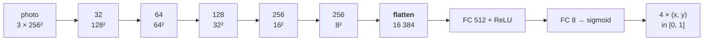
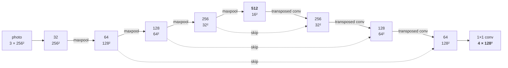

# Corner detection

Where is the page in the photograph? Four points is the whole answer, and it is the second of the
project's two mandatory networks *(brief §5)*. Everything downstream depends on it: the enhancement
network only ever sees a page that has already been flattened, and flattening needs a homography,
and a homography needs four corners.

The brief asks for this one to be solved **twice**, in two formulations that behave differently, and
for the experiments rather than the author to decide which wins. Both are built here, trained from
the same generator on the same samples with the same schedule, so the comparison is about the
formulation and nothing else.

> The prediction about which one wins, and why, is in
> [`reports/PREDICTIONS.md`](../reports/PREDICTIONS.md). It was committed before either detector had
> taken a training step, which is the only thing that makes it a prediction.

## What the detector sees

One composited photo, resized to **256×256** and normalised to [0, 1] — the whole frame, page and
desk and shadow together, not a crop. Labels are the four corners in TL, TR, BR, BL order, normalised
to [0, 1] by width and height, which is what makes the task resolution-independent *(brief §2.2)*.

The labels are free. The generator *chose* those four points to warp the scan onto, so they are exact
by construction rather than annotated — the single most valuable trick in the whole project, and the
reason a training set of unlimited size costs nothing to label.

256 is enough, and this is worth separating from the enhancement network's opposite conclusion. There,
resolution *is* the task: a pen stroke reduced to under a pixel is gone and no loss recovers it.
Here the task is a page-sized object against a background, which survives being seen at 256 perfectly
well. The detector is the cheap network and the enhancer is the expensive one, and they disagree about
resolution for a good reason.

**The two tasks are trained on deliberately different worlds.** The corner detector's samples also
include tinted and dark page stock, a second sheet of paper in frame as a distractor, and pages that
will not lie flat — all cases the real photos contain. The enhancement network sees none of them,
because its target *is* the flat clean scan. `SynthOptions.from_config` strips them by task,
structurally rather than by default, and the frozen evaluation sets are generated per task for the
same reason.

## Approach A — direct coordinate regression

`CornerRegNet`, in [`src/scandar/model.py`](../src/scandar/model.py). 10.7 M parameters.



Five `ConvBlock`s, each followed by a max-pool, then two fully connected layers. The
one decision worth defending is the **flatten**. Global average pooling — the reflex after an encoder
— answers "is there a corner-like thing in this image", which is a classification question. A
coordinate is made of *where* the activation fired, and pooling is precisely the operation that
discards that. So the 8×8×256 feature map is flattened whole, and 8.4 M of the model's parameters end
up in a single matrix.

That matrix is also where the difficulty lives. It has to learn the entire map from feature position
to coordinate from scratch: nothing in the architecture knows that a page ten pixels further right
should produce an answer ten pixels larger. Translation equivariance, which convolutions give away
for free, is thrown away at the flatten and has to be relearned as a lookup.

Two details:

* **The output is squashed through a sigmoid**, so a coordinate cannot leave the frame. Every label
  is inside [0, 1], so nothing is lost, and the alternative is a network that can answer -3.
* **The final bias starts at an average page** — corners at (0.25, 0.25), (0.75, 0.25), (0.75, 0.75),
  (0.25, 0.75). An untrained network then answers "a page, roughly centred, filling about half the
  frame" instead of answering noise, in the same spirit as the enhancement network's residual head
  starting at the identity.

## Approach B — heatmap regression

`CornerHeatNet`. 7.7 M parameters — the same encoder-decoder family as the enhancement network, which
is what the brief suggests reusing.



Two changes from `DocUNet`. The head emits **one channel per corner** instead of three colour
channels, and the decoder **stops one level short** of full resolution: 256 in, 128 out. Predicting at
half resolution costs a quarter of the decoder's work and gives up nothing that matters, because the
coordinate is read back with a sub-pixel expectation rather than with the index of the brightest cell.

The targets are Gaussians of σ = 3 heatmap cells, drawn at the corner's *sub-pixel* position rather
than snapped to the nearest cell, so that reading the target back reproduces the label instead of a
quantised version of it. There is a sanity check for exactly that.

**Why this should behave differently.** Every output cell is spatially aligned with the input, so
"there is a corner here" stays a local decision made on local evidence, and translation equivariance
comes free. The supervision is also denser by four orders of magnitude — 4 × 128 × 128 = 65 536
supervised values per sample against eight. What it gives up is a continuous output: the map is a
grid, and everything sub-pixel has to come out of the extraction.

**The head is linear, not squashed.** The targets are Gaussians in [0, 1], so a sigmoid is tempting,
but MSE against a saturating output learns slowly in exactly the two regions that matter — the peak
and the far background. `head_activation: sigmoid` exists for the ablation.

### Reading a coordinate back off a map

`soft_argmax2d`, and the plain `heatmap_peaks` it has to beat.

A hard arg-max is quantised to the cell grid: at 128 cells for a 256-pixel input that is two pixels,
which is the same order as the error being measured. The soft version takes the **centre of mass** of
the map instead, which is differentiable — that is what allows a coordinate loss to be applied to a
heatmap model, and what the bonus part's end-to-end fine-tuning would need.

Two ways to turn a map into weights. The default treats it as an unnormalised density: clamp the
negatives away and divide by the total. Applied to a *target* heatmap this returns the label it was
drawn from to within 0.04 px, which is the property that makes it testable — an extraction that cannot
invert its own targets has no business being trusted on predictions. The alternative is a softmax with
a temperature, which is scale-free but depends on that temperature, and at any finite value a flat map
pulls the estimate toward the centre of the frame.

At inference the expectation is restricted to a **window around the peak**, and this turned out to
matter far more than expected. Measured on the first trained detector, over the 200-photo synthetic
test bucket — the same weights, three ways of reading them:

| extraction | mean error (px @256) | PCK @ 1% |
|---|---:|---:|
| global centre of mass | 6.83 | 0.000 |
| plain arg-max | 1.38 | 0.915 |
| **windowed centre of mass** | **1.06** | **0.890** |

**A factor of six, from the same network.** The head is linear, so its background is not zero but
small positive *noise*, and spread over 16 384 cells a little noise everywhere carries more mass than
the blob does. A global centre of mass therefore measures mostly the background and reports something
near the middle of the frame. The signature was visible in the results before the cause was: PCK was
*exactly* zero below 1% of the diagonal on every split and at every epoch, which is a floor no amount
of training pushes through, and no learning curve looks wrong when the whole curve is shifted.

The real defect was not the maths, it was having three call sites — the trainer's validation metric,
the evaluation table and the inference pipeline — that could disagree about how to read a model, and
did. There is now one function, `model.corners_from_output`, and all three use it. The window is off
only where it should be: inside a coordinate loss during training, where the gradient should reach
the whole map, including the background it needs to learn to suppress.

It also does the job it was originally added for. The generator puts a distractor sheet in a fifth of
its corner samples, and a centre of mass over two blobs returns a point that is on neither page.

## The losses

[`src/scandar/losses.py`](../src/scandar/losses.py). One `CornerLoss` serves both approaches, because
they differ in which terms carry a weight rather than in how the loss is assembled — and because that
makes the comparison a config file rather than a second code path that could differ in some detail
nobody notices.

| Term | Used by | What it is |
|---|---|---|
| `coord_l1` | approach A | L1 on the normalised coordinates. The brief's own suggestion. |
| `coord_wing` | the ablation | The Wing loss: logarithmic when the error is small, L1 when it is large. |
| `heatmap` | approach B | Pixel-wise MSE on the Gaussian maps. |
| both at once | `corner_heat_aux` | A coordinate term applied to the **soft-argmax of the predicted maps**, so the gradient flows through the extraction the detector is actually read with. |

**Why a Wing loss is worth an ablation.** L1 gives a 40-pixel error and a 1-pixel error exactly the
same gradient. That is right early, while the detector is still finding the page, and wrong late, when
every remaining sample is nearly right and nothing is pushing it to be precisely right. The Wing loss
switches to `w · ln(1 + |e|/ε)` inside a width `w`, where the gradient *grows* as the error shrinks.
The published values — 10 px and 2 px — happen to sit exactly where this task's errors are expected to
end up. It is computed in pixels of the 256-pixel input, because that is the space those constants
were chosen in, and divided back down on the way out so that swapping it in for an L1 does not
silently change the effective learning rate as well as the loss shape.

**Every weight defaults to zero.** A config that names a term it did not mean gets an empty loss and
an immediate error rather than a silent default. That failure has already happened once in this
project, in the generator's options, and it cost a set of quietly wrong evaluation samples.

## The metrics

[`src/scandar/metrics.py`](../src/scandar/metrics.py), all measured in the detector's own 256×256
space — the only space in which two detectors, or two photographs of different sizes, are comparable
at all.

| | |
|---|---|
| **corner error** | Mean Euclidean distance between predicted and true corners, averaged over the four corners of a photo and then over photos. The brief's headline metric. Reported in pixels **and** as a percentage of the 362-pixel diagonal, because a pixel count means nothing without the size it was measured at and the percentage survives any resize. |
| **PCK** | The fraction of photos where **all four** corners land within a threshold. Three good corners and one bad one is a bent page, and a mean over corners hides exactly that. Swept over ten thresholds into a curve, because choosing a single threshold after seeing the numbers is how a comparison stops being one. |
| **quad IoU** | How much of the page the prediction would actually rectify. Corner error says how far off it is; this says what that costs the enhancement stage downstream. |

The table carries its own **no-model baseline**, the way the restoration table does: the classical
Canny detector, run on the very same 256×256 input the network sees. A learned detector that cannot
beat a rectangle-finder from before neural networks is not earning its parameters either. A photo the
classical detector fails on is scored as the whole frame rather than dropped — dropping it would
flatter the baseline by measuring it only where it succeeded.

## Training

The same config-driven trainer as the enhancement network. What varies is read off the model's
`output_kind`, so there is one loop and not two:

```bash
python train.py --config configs/corner_reg.yaml
python train.py --config configs/corner_heat.yaml
python evaluate.py --config configs/corner_heat.yaml
```

### What a corner sample costs

The enhancement network amortises one composited photo over eight training patches. **A corner sample
is one whole photo**, so there is nothing to amortise, and this task runs at the generator's raw rate
— roughly an eighth of the throughput the enhancement runs report. The rate printed at the end of the
first epoch is the real number; read it before committing to a full run.

**The canvas is the lever, and it points the other way here.** The detector resizes every photo to
256×256 before it sees anything, so the canvas decides almost nothing about the task and almost
everything about the cost: compositing and degrading at 1920×2560 does 2.8× the pixel work of
1152×1536 for a sample that is thrown away down to 256 either way. The enhancement network needed the
large canvas for a concrete reason — its training pair is rectified at 1024×1448, so a small canvas
*upsampled* every page into the target and asked the model to invent detail that was never captured.
None of that applies to a task whose input is 256 pixels wide, so the corner configs composite at
1152×1536 and give up nothing but a little resampling fidelity.

Measured end to end through the real training loop on the 3060 at batch 16:

| | samples/s | 48 000 samples |
|---|---:|---:|
| `corner_reg` (10.7 M parameters) | 6.5 | 2.0 h |
| `corner_heat` (7.7 M parameters) | 6.1 | 2.2 h |
| *the same, on a 1920×2560 canvas* | *~2.3* | *~5.8 h* |

The two detectors run at nearly the same rate despite one carrying 40% more parameters, which is the
same story the enhancement runs tell: the loop waits on the CPU generating photos, not on the GPU
consuming them. Model capacity is close to free here; throughput work is not.

The frozen corner buckets have to be generated at the same canvas, or the validation curve measures a
distribution the model is not learning — the trainer warns when the two disagree:

```bash
python scripts/freeze_eval_sets.py --config configs/corner.yaml --task corner --force
```

That touches only the three corner buckets. The enhancement ones are generated from their own config
and are left alone.

### What is steered on

`val_corner_err`, not the validation loss. The two detectors are trained against different losses
whose values are not comparable to each other — a heatmap MSE and a coordinate L1 are not the same
kind of number — and the localisation error is.

## Inference *(brief §5.1)*

`pipelines.detect_corners`. A raw photo in, four corners out:

```bash
scandar detect --input photo.jpg --output overlay.png --checkpoint outputs/runs/corner_heat/best.pt
```

1. **Preprocess** — resize to 256×256 with an area filter and scale to [0, 1], exactly as the training
   dataset did. There is no mean/standard-deviation normalisation anywhere in this project.
2. **Predict** — either formulation, read back to the same normalised `(4, 2)`.
3. **Map back** to the original resolution. One multiplication, and the step the brief warns about:
   a coordinate scaled by the wrong factor is a wrong label that looks like a bad model.
4. **Order and check** — canonical TL, TR, BR, BL, then a look at whether the result is a
   quadrilateral a page could be.
5. **Overlay** — the quad drawn on the photo with its corners *labelled*, because the failure this
   project is most exposed to is a permuted quad, and four anonymous dots look the same either way.

Two batch scripts wrap it, both taking files, directories or globs:

```bash
python scripts/detect_batch.py  --input data/real/photos          # corners + overlays + heatmaps
python scripts/enhance_batch.py --input data/real/photos --detect  # photo in, clean scan out
```

`detect_batch.py` writes its corners into a `corners.json` in exactly the format `enhance_batch.py`
reads, so the two can be run in sequence with an inspection — and a correction — in between. The
per-photo figure puts the overlay, the heatmap and **the flattened page** side by side, and the third
panel is the one to look at: a quad drawn on a photo always looks roughly right, while a page that
comes out skewed or cropped tells you immediately that it was not.

### The guardrail

If the predicted quad is degenerate — crossed, collapsed, or a sliver — the pipeline falls back to a
classical detector: Canny with thresholds taken from the image's own median, morphological closing,
`findContours`, and `approxPolyDP` with a sweep of tolerances, keeping the first convex quadrilateral
that could be a page. The result carries a `source` field saying which path ran, so a caller scoring a
whole set can count how often the fallback was needed. If even that finds nothing, the pipeline
returns the frame itself: wrong, but wrong in a way a human can see and correct in one glance, which
beats raising in the middle of a demonstration.

This is cheap insurance for presentation day, and it is built from the course's own techniques. The
two detectors fail on different things — a neural detector on a background it has never met, a
classical one on a busy surface or a page running out of frame — so they rarely fail together.

Measured on frozen synthetic photos, the classical path finds a page in roughly half of them, and
when it does it lands within **0.4% of the image diagonal** — near-exact. That shape is worth
knowing: it is not a mediocre detector, it is an excellent one that abstains often. Which is exactly
what a fallback should be, and it is why the evaluation table quotes its mean error *and* its strict
success rate side by side — on a barely-trained network the classical baseline was behind on mean
error and far ahead on PCK, because a uniformly mediocre answer beats an abstention on the average
and loses on every individual photo.

The validity check is deliberately **looser** than the generator's own placement rules. Those describe
pages this project *creates*; these describe pages it must not refuse to believe in. A page may be
photographed close enough to fill the frame or with a corner just off it, and rejecting that would
send a perfectly good detection to the fallback.

## What the heatmap detector measured

20 epochs × 150 steps at batch 16 — 48 000 photos, 2.2 hours on the 3060.

| Split | corner error (px @256) | % of diagonal | PCK@2% | quad IoU |
| :--- | ---: | ---: | ---: | ---: |
| Training | 0.79 ± 1.23 | 0.22% | 0.975 | 0.9863 |
| Validation | 0.70 ± 0.84 | 0.19% | 0.980 | 0.9877 |
| **Test** | **1.06 ± 2.44** | **0.29%** | **0.955** | **0.9830** |
| *classical baseline, test* | *41.66* | *11.51%* | *0.485* | *0.6582* |

**About one pixel of a 256-pixel input**, and 95.5% of unseen photos have all four corners inside 2%
of the diagonal. Three things worth reading off it.

**There is no overfitting, again.** Training to test is 0.27 px. Same reason as the enhancement
network: an unlimited generator leaves nothing to memorise. It also means the run was not
data-limited, and the curve was still improving when the schedule ended — a longer run is the obvious
next experiment, not more regularisation.

**The baseline has the opposite error profile, and that is why both metrics are reported.** The
classical detector is 40× worse on mean error but only 2× worse on PCK, because it is near-exact when
it finds a page and returns nothing at all otherwise — a distribution with no middle. A mean rewards
being uniformly mediocre; PCK rewards being right. Quoting either alone would misrepresent one of the
two detectors.

**The tail is what is left.** The mean is 1.06 px but the standard deviation is 2.44, so the error is
a spike at half a pixel with a handful of samples in the twenties. Those are the failure gallery, and
they are worth more attention than the mean is.

### On real photos

Not a measurement — the annotation export has not landed, so there are no labels to score against —
but the 19 real photos run through `scripts/detect_batch.py` give a strong qualitative signal.
**Seventeen of nineteen came from the network**, on carpet, marble, wood and a red table, through
hard photographer shadows and at angles. Of the other two:

* the closed leather notebook, where the model put sharp confident blobs on three of the object's
  corners and the fourth on the wrong side — a non-convex quad, which the validity check rejected and
  the classical detector also declined, so the pipeline returned the frame and said so;
* one photo where the model's quad had a 43-pixel edge and the classical path took over and got it
  right.

Both went the way the guardrail was designed to go. The heatmap panel in the per-photo figure is what
made the first one diagnosable in seconds: a wrong corner because the map is *diffuse* is a model that
does not know, and a wrong corner because the map has *two* peaks is a model that found the wrong
page, and those want opposite fixes.

## The experiments this is set up for

| Config | Question |
|---|---|
| `corner_reg` | Approach A, the baseline: L1 on coordinates. |
| `corner_heat` | Approach B, the baseline: MSE on heatmaps. |
| `corner_reg_wing` | Does the Wing loss's amplified small-error gradient buy the last pixel? |
| `corner_heat_aux` | Does optimising the soft-argmax's output beat optimising the map it comes from? |

## Not built yet

**The real-photo half of the comparison**, which is the half the brief cares most about. It needs the
Roboflow COCO-keypoints export, which has not landed; `scripts/parse_roboflow.py` and the real-photo
dataset are deliberately unwritten rather than written blind against an export whose shape is unknown.
Also the dropout study *(brief §6)*, the failure-case galleries and PCK curve figures, and the
end-to-end scanner that chains this detector to the enhancement network *(brief §7, the bonus)*.
