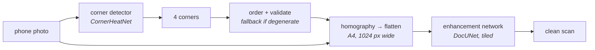

# The end-to-end scanner

*The bonus (brief §7). A phone photo goes in, a clean scan comes out, and nobody clicks anything.*

Both mandatory tasks solve half of the problem. The corner detector finds the page in a photograph
but hands back four numbers; the enhancement network turns a flattened page into a scan but has to
be given one already flattened. Chaining them is the whole application:



There are **two implementations of that diagram in this repository**, and the difference between them
is the point of the bonus.

| | `pipelines.scan_document` | `model.EndToEndScanner` |
|---|---|---|
| Built from | OpenCV | torch, over `scandar/warp.py` |
| Warp | `cv2.warpPerspective` | `F.grid_sample` on a grid from a solved homography |
| Corner ordering | yes, plus the classical fallback | no — see below |
| Output | the whole page, in tiles, at full resolution | one 256×256 patch of it |
| Gradient | none | **the whole way back to the corners** |
| Used for | inference, the demo, presentation day | fine-tuning the detector through the enhancement loss |

The inference chain is what runs on a photograph. The differentiable chain is what makes the loss
*end to end*, which is what the bonus is graded on — and the two agree pixel for pixel, to a tenth
of a grey level, which is asserted by a test rather than assumed.

**Both are available at inference, from the same call.** `rectify_document(..., backend="torch")`
runs the differentiable warp for real, and `scan_document(..., warp="torch")` puts it in the middle
of the chain; `--warp torch` does it from the command line. On a real photograph the two flattenings
differ by **0.001 of a grey level on average and one level at worst**, and the finished scans by 0.01.
That equivalence is not a curiosity — it is the evidence that what the fine-tuning trains through is
the same operation the shipped pipeline performs, which is the only thing that makes the gradient
meaningful.

## The inference chain

```bash
# the two networks, named separately
scandar scan --input photo.jpg --output scan.png \
    --detector outputs/runs/corner_heat/best.pt \
    --enhancer outputs/runs/enhance_realistic/best.pt

# or one fine-tuned chain, which carries both halves
scandar scan --input photo.jpg --output scan.png \
    --scanner outputs/runs/corner_heat_e2e/best.pt

# either of those, with the page flattened by the differentiable warp instead
scandar scan --input photo.jpg --output scan.png \
    --scanner outputs/runs/corner_heat_e2e/best.pt --warp torch
```

In code that is `pipelines.scan_document(photo, detector, enhancer)`, and it also accepts an
`EndToEndScanner` in place of the detector, taking both halves out of it. `--rectified` writes the
flattened page beside the finished scan, `--width` sets its resolution, and `--keep-aspect` estimates
the page's shape from the quad instead of assuming A4.

`scan_document` runs four steps, and the second is the one it lives or dies on.

1. **Detect** the corners at the photo's own resolution, through the §5.1 pipeline.
2. **Order and check.** Corners come back in canonical TL, TR, BR, BL order, and the quad is
   checked for being a shape a page could actually be. This matters more here than anywhere else in
   the project: the enhancement network has never seen a page upside down or mirrored, so a permuted
   quad does not degrade the output gracefully, it ruins it. If the quad is unusable, the classical
   Canny detector gets a turn; if that fails too, the frame itself is used. **The chain always
   produces something.** For a grade decided live on photographs nobody has seen, a chain that is
   occasionally mediocre beats one that is usually brilliant and sometimes returns a smear.
3. **Rectify** at 1024 px wide on the A4 aspect the scans were made at — not on the quad's own edge
   lengths, because a page photographed from an angle understates one of its dimensions and an
   aspect read off the projection squashes the result. `--keep-aspect` estimates it from the quad
   instead, for a document that is not A4.
4. **Enhance** in cosine-blended overlapping tiles, exactly as `scandar enhance` does.

The returned dict carries `source` — `model`, `classical`, `frame` or `given` — so a caller scoring a
folder can count how often the fallback ran. That count is worth knowing *before* presentation day
rather than during it.

Passing `corners=` skips the detector and flattens the page with points handed in: annotated corners,
or four clicks. That is what makes the evaluation below possible.

## The differentiable chain

The brief presents this as optional. The grading is stricter than the prose: full marks for the bonus
require the loss to be computed end to end — differentiability from the end of the chain back to its
start — so this is the substance of the work rather than a flourish on top of it.

`scandar/warp.py` rebuilds two OpenCV functions in torch:

* **`homography_from_points`** — the four-point solve `cv2.getPerspectiveTransform` does, as an 8×8
  linear system through `torch.linalg.solve`. It agrees with OpenCV to about 1e-8, and it
  differentiates in both the source and the destination points.
* **`warp_perspective`** — sampling, as `F.grid_sample` over a grid built from that matrix.

kornia would have done both and is explicitly permitted for the bonus (the no-third-party rule binds
the *degradation pipeline*). It is not used: the differentiable path is two dozen lines, and this is a
project whose point is that the pieces are built rather than imported. It is also not installed, and
the development machine has half a gigabyte of disk left.

### Four decisions that make it work

**The windowed soft-argmax, not the global one.** The extraction is differentiable either way — the
window is a constant mask, so the gradient reaches the 11×11 neighbourhood of the peak instead of the
whole map, which is what you want. The global expectation measures the linear head's background noise
and lands 6.8 px out (see [corner detection](corner-detection.md)); a warp built on corners that wrong would leave the
loss measuring misalignment rather than restoration.

**No `order_corners` in the training path.** It is numpy, so it would sever the graph — and it is
unnecessary, because the heatmap channels are TL, TR, BR, BL by construction. Ordering stays where it
belongs, as an inference guardrail.

**Warp straight to a 256×256 patch.** A whole 1024×1448 page through the enhancement network with a
backward pass does not fit on a 6 GB card. The crop is composed into the homography — the torch twin
of `Sample.rectify_patch` — so a step costs what the enhancement baseline's step cost. The crop
origin is a constant, so the gradient reaching the corners is unaffected by it.

**Float32 for the solve and the warp.** The system is built from products of coordinates that reach
into the millions on a 2560-pixel photo, and fp16 has three decimal digits to spend on them. Both
functions cast and disable autocast around themselves, for the same reason the restoration loss
already computes SSIM's variance products in fp32.

### What the gradient actually is

`grid_sample` differentiates with respect to its sampling grid, and that derivative is the **image
gradient at the sample points**. So moving a corner changes the loss only through the intensity slope
of what lies under the resampled page: it is Lucas-Kanade's derivative, arrived at from the other
direction. Where the page is blank white paper the gradient is genuinely zero, and that is not a bug.

The chain is anchored by its target, not by its warp. The clean rectified patch is fixed and comes
from the *true* corners, so any wrong warp raises the loss and there is no degenerate zoom for the
optimiser to escape into.

### Proving it exists

One assertion, in the sanity checks and again in the tests:

```
inference: end-to-end scanner
  ✓ gradient reaches the corners   |dL/dcorners| 9.476e-02, detector weights 4.987e+00
```

Push the enhancement loss back through the enhancer, the warp and the homography solve; the gradient
sitting on the predicted corners is finite and non-zero, and so is the gradient on the detector's own
weights. That is what "the loss is computed end to end" means, and it fails the moment anyone puts a
numpy call, a `.numpy()` or a convenience `detach` into the chain — which is an easy thing to do while
tidying a pipeline.

## The joint dataset

Neither existing dataset fits. `SyntheticEnhanceDataset` hands over a page that has *already* been
flattened, with the true corners — which is precisely the step being learned — and
`SyntheticCornerDataset` has no restoration target. `SyntheticScanDataset` is a third view of the same
`Sample`, so it needed no generator work:

| key | what it is |
|---|---|
| `image` | the photo at the detector's input size, 256² |
| `source` | the photo again, large, **in 8 bits** — what the warp resamples the page out of |
| `corners` | the true corners, normalised |
| `target` | the clean scan, cropped to one 256² window of the page rectified at 1024×1448 |
| `box` | where that window sits on the page |

**`source` is kept at full resolution on purpose.** The page occupies 0.42 to 0.90 of the canvas
height, so on the 1920×2560 canvas it is 1075 to 2300 px tall and the target is rectified at 1448.
Shrink the photo to save memory and the page is *upsampled* into the target — the exact pathology
`enhance_realistic` was written to remove, reintroduced one stage later. It travels as uint8 instead,
which is a quarter of what a float copy costs through the loader, and becomes an image on the GPU.
Nothing else in the project moves 8-bit tensors around, so it is worth knowing that this one does.

**The input half of the pair is never generated.** The model warps its own input, out of the photo,
through the corners the detector predicted. Warping it here with the true ones would be the answer.

**Nothing new was frozen.** The chain is validated and scored on the existing `frozen/enhance/`
buckets: whole composited photos, corner labels, source scan, corner-only options stripped so the
restoration target is achievable, on the canvas the enhancer was trained through. That *is* an
end-to-end bucket. The caveat belongs in the report rather than in a footnote: **those photos carry no
distractor sheet**, so the detector scores better on them than on its own bucket, and the corner
numbers here are not interchangeable with the ones in the detector table.

## The fine-tune

```bash
python train.py    --config configs/scan_e2e.yaml
python evaluate.py --config configs/scan_e2e.yaml --assembled --name scan_assembled  # before
python evaluate.py --checkpoint outputs/runs/corner_heat_e2e/best.pt                 # after
```

`--assembled` scores the chain as *bolted together* from the two finished runs, ignoring the
fine-tuned checkpoint even when one exists. That is the baseline the fine-tune has to beat, and it is
also what runs automatically when no checkpoint exists yet, so the "before" column can be produced in
either order. The two arms write to different files (`scan_assembled_scan.*` against
`corner_heat_e2e_scan.*`, and `evaluation_scan_assembled.json` against `evaluation_scan.json`)
precisely so that neither can quietly overwrite the other — which it did, once, during development.

What is trained: **the detector, and only the detector**, by the enhancement loss, through the warp.
The enhancer is frozen — under a joint loss it would otherwise learn to absorb the misalignment,
because blurring slightly makes a corner error stop costing anything, and the detector would receive
no signal at all. That is the one outcome that would make the experiment meaningless rather than
merely negative. `freeze_enhancer: false` is the ablation. Freezing is enforced in two places, and
the second is easy to forget: the parameters have `requires_grad=False`, *and* the submodule is held
in eval mode so batch normalisation does not drift its running statistics towards the warped patches.

It runs under a new name, `corner_heat_e2e`. `corner_heat` and `corner_reg` are a matched pair
answering §5, and fine-tuning either one would quietly invalidate that comparison.

The prediction, written before it ran: **no measurable improvement.** `corner_heat` starts at 1.06 px
mean error — already well inside the basin — and the gradient reaching it is photometric. That is a
legitimate answer to the question the brief asks, and reporting it honestly with the numbers that
make it unsurprising is worth more than a tuned result.

### What actually happened

Five epochs, 750 optimiser steps, 12 000 samples, **83 minutes** at 2.4 samples/s. The training loss
barely moved (0.1554 → 0.1533) and neither did anything else, which is the prediction coming true:

| per-epoch validation, 200 frozen photos | epoch 1 | epoch 5 |
|---|---|---|
| corner error (px @256) | 0.802 | **0.776** |
| PSNR of the restored patch | 20.23 | **20.42** |
| SSIM | 0.8411 | 0.8466 |
| quad IoU | 0.98608 | 0.98647 |

Monotone, in the right direction, and tiny: **3% off the corner error** over the whole run. The
learning rate reached its floor by epoch 4 and the last two epochs are flat, so this is where a run at
this rate converges, not a run cut short.

**The verdict, in one line: the chain trains, and there was nothing left to train.** A detector
already at a fifth of a pixel on this distribution, fine-tuned by a photometric gradient on an
*easier* distribution than it was trained on, has almost no headroom — and the honest reading is that
the bonus demonstrated the mechanism rather than improved the model. That was the predicted outcome
and it is written down above, in the same form the [corner comparison](corner-detection.md) and the
[dropout study](dropout-study.md) were scored.

Two things worth noticing rather than glossing over. **PCK went 1.000 → 0.990** on the 50-photo sample
first measured — one photo's worst corner crossed the threshold in the wrong direction — which is
what a 3% mean improvement looks like when it is distributed unevenly, and a reminder that a mean is
not a guarantee. And the fine-tune happened on the enhancement distribution, which has **no distractor
sheets**: the risk was never that it would fail to improve, but that it would *degrade* the detector on
the harder world it was trained for. That is why the detector is re-scored on its own bucket below.

## What the chain is scored on

`evaluate.py` runs the whole chain **twice over the same photographs**: once on the corners the
detector found, once on the true ones. Both arms are scored against one fixed target — the clean scan
rectified with the true corners — so a misplaced corner is punished as the misalignment it is
downstream. The gap between the two arms is the price of the detection step, in decibels, which is a
more useful number than either arm alone.

Beside it, on the same photos, the comparison the bonus is graded on in its own right: **the predicted
corners against the true ones**, in the detector's 256² space so the numbers read against the detector
table.

### The results, before and after

All 200 photos of the synthetic test bucket, both arms on the same photographs through the same code
— `scan_assembled` is the chain bolted together from `corner_heat` and `enhance_realistic`,
`corner_heat_e2e` is the same chain after the fine-tune.

| | assembled | fine-tuned |
|---|---|---|
| corner error (px @256) | 0.68 ± 0.54 | **0.66 ± 0.56** |
| PCK@2% | 0.995 | 0.990 |
| quad IoU | 0.9876 | 0.9879 |
| chain, detected corners | 18.97 ± 1.76 dB | **19.01 ± 1.77 dB** |
| chain, true corners | 26.70 dB | 26.70 dB |
| degraded input | 15.30 dB | 15.30 dB |
| corners from the model path | 200 of 200 | 200 of 200 — the fallback never ran |

The last three rows are identical in both arms, as they have to be — same photos, same frozen
enhancer, and only the detector was trained. That is a free consistency check on the whole apparatus.

**Paired, photo by photo**, which is the honest way to read an effect this small:

| | mean change | improved on |
|---|---|---|
| corner error | **−0.016 px** | 130 of 200 |
| PSNR | +0.035 dB | 110 of 200 |
| quad IoU | +0.0003 | 67 of 200 |

130 of 200 is a real effect — a sign test puts it at p ≈ 1.3 × 10⁻⁵ — and it is also **2.4% of an
error that was already a fifth of a pixel**. The PSNR column is indistinguishable from a coin flip
(p ≈ 0.09), exactly as the metric's behaviour below predicts. So the fine-tuning *does* something,
measurably, and what it does is worth nothing in practice. That is the result, and it was the
prediction.

The quad IoU row is the interesting one: the mean improves while **two thirds of photos get slightly
worse**, so the gain comes from a few large corrections rather than a broad one. That fits what the
gradient is: a photometric nudge that moves individual corners along local image gradients, not
something that reasons about the page outline. The worst regression went 1.34 px → 2.60 px.

### Three things worth reading off the table

**The detector is more accurate here than on its own bucket** — 0.66 px against 1.06 — which is the
missing distractor sheet showing up as a number, exactly as warned above.

**The true-corner arm lands where the enhancement table says it should.** 26.70 dB against the
enhancement network's own 26.67 on the same bucket, reached through a completely different code path
— detection skipped, `rectify_document` at A4 instead of `Sample.rectify`, the scanner's own tiling.
That agreement is the best evidence the chain is wired correctly.

**But the 7.7 dB the detection step costs is almost entirely a floor, not a slope.** On a fifty-photo
sample the correlation between corner error and PSNR cost is **0.09** — nothing. The photo with the
*best* corners (0.25 px) lost 8.4 dB; the photo with the *worst* (3.2 px) lost 5.2. Sub-pixel
misregistration of text destroys PSNR immediately and then stops caring how large the error is, which
is the same reason the enhancement pair had to be aligned to a hundredth of a pixel in the first
place *(brief §2)*.

So: **PSNR here measures registration far more than restoration, and it saturates at once.** The
chain's output at 19 dB is perfectly readable — every scan in this project's demonstrations came out
of exactly this chain. Two consequences for the report. Present the pair of arms rather than the
single number; and do not read the fine-tune's flat PSNR as evidence that the corners did not move,
because the metric had already bottomed out before the fine-tune started.

### Did the fine-tune cost the detector anything?

The risk that mattered was never that the chain would fail to improve. It was that fine-tuning on the
enhancement distribution — **no distractor sheets, no tinted stock, no curl** — would quietly degrade
the detector on the harder world it was actually trained for, and that the damage would be invisible
in a table computed on the easy bucket.

`evaluate.py --part detector` scores the detector *inside* the scanner checkpoint on the corner
buckets, through the same code and the same frozen photos its baseline was measured with, so the
answer is directly comparable to the [corner detection](corner-detection.md) table.

| corner test bucket — with distractors, tint and curl | corner error | PCK@2% | quad IoU |
|---|---:|---:|---:|
| `corner_heat` | **1.06 ± 2.44 px** | **0.955** | **0.9830** |
| `corner_heat_e2e` | 1.10 ± 2.74 px | 0.950 | 0.9826 |

So the fine-tune gains 0.02 px on the easy distribution and gives back 0.04 px on the hard one. Both
differences are noise-sized, and they point in the directions you would expect from training on a
world with no distractor sheets in it.

**Which is why `corner_heat` remains the shipped detector.** Every script still defaults to it, the
§5 comparison it belongs to is untouched, and `corner_heat_e2e` stands as what it was built to be:
the demonstration that the chain is differentiable end to end, with the numbers to say honestly what
that bought. Fine-tuning on the enhancement distribution to improve a detector that has to survive
photographs of paper lying on other paper was never the trade to make; the mechanism is the deliverable.

## Cost, and a warning about disk

One sample is one composited photo with no patch amortisation, and this task composites on the
1920×2560 canvas, so the loop runs at that canvas's photo rate. **Measured end to end through the real
loop at batch 4 × 4 accumulated: 2.1 samples/s, peak GPU memory 1.65 GB of the 3060's 6.** The warp
and the enhancement step are GPU work landing in time the CPU-bound loader is already wasting, which
is why a chain of two networks costs no more per photo than the generator does — and why the small
batch costs nothing either. The config's 5 × 150 × 16 = 12 000 samples is therefore about
**1.6 hours**, plus twelve seconds per epoch to validate on 200 frozen photos.

A scanner checkpoint holds **both** networks: `best.pt` is 62 MB and `last.pt` 124 MB, against 31 and
93 for a single model. Check `df -h /` before starting a run.
