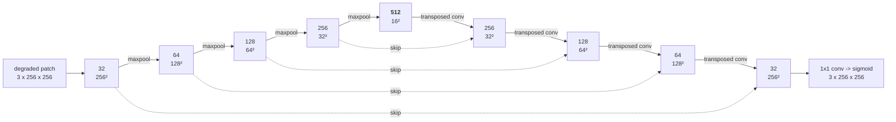

# The enhancement network

A degraded, rectified page goes in; a clean scan comes out. This is the first of the project's two
mandatory networks *(brief §3)*, and this page explains what it is, how it is trained, and which of
the decisions behind it were deliberate.

Everything here is built from scratch: no imported U-Net, no pre-trained weights, and — in this first
version — no dropout and no weight decay, because the brief asks for that and because the
regularisation study later only means something if dropout is the single thing that changed.

## The architecture

`DocUNet`, in [`src/scandar/model.py`](../src/scandar/model.py). An encoder–decoder with concatenated
skip connections: 7.76 M parameters, a 31 MB checkpoint in fp32.



Every box is a `ConvBlock`: **(Conv 3×3 → BatchNorm → ReLU) × 2**. The convolutions carry no bias,
because the normalisation immediately after would subtract it straight back out.

**Why an encoder at all, when the output is the same size as the input?** Because the defects are not
local. Whether a dark patch is a shadow or a smudge of ink is not answerable from a 3×3
neighbourhood — you have to see a large part of the page at once. Four halvings put a 3×3 kernel at
the bottleneck in view of roughly a quarter of the patch, which is the scale a shadow lives at.

**Why the skip connections matter more here than in most segmentation work.** A pen stroke is two or
three pixels wide. Sixteen-fold downsampling leaves *nothing* of it — not a blurred version, nothing —
so a decoder rebuilding the page from the bottleneck alone would have to hallucinate the handwriting.
The skips hand each decoder stage the encoder's feature map at its own resolution, so fine detail
never has to survive the bottleneck; only the *context* does. `configs/enhance_no_skips.yaml` trains
the identical network without them, so the report can show that rather than assert it.

**Two output heads, as an ablation.** The default is direct: a 1×1 convolution and a sigmoid, so the
output is a valid image by construction. The alternative predicts the *correction* and adds the input
back (`configs/enhance_residual.yaml`). Most of a document photo is already right, so a residual head
starts the network at "change nothing" rather than at "invent a page". The correction passes through
a tanh, whose range is exactly the largest change any pixel can legitimately need.

**It is fully convolutional, and it pads internally.** Nothing in the network cares about the input
size, and a page rectified to 1024×1448 is not a multiple of the sixteen-fold downsampling, so the
forward pass pads by replication and crops the result back. That is what lets the same weights train
on 256×256 patches and restore a whole page.

## Patches, not pages — the central decision

The network trains on **256×256 crops of pages rectified at 1024×1448**, never on whole pages
downscaled to fit.

Squeezing an A4 page into 256×256 makes a pen stroke less than one pixel wide. The information is
gone before the network sees it, and no loss function recovers what the resize threw away — the model
would learn to produce a plausible grey smudge, which is exactly the failure the whole project is
trying to avoid. Training on crops at native resolution keeps every stroke several pixels across.

The cost is that the network never sees a whole page during training. It does not need to: shadows
and illumination gradients are smooth over hundreds of pixels, so a 256-pixel window still contains
the *gradient* even when it does not contain the whole shadow.

### Why 256 and not 512

Worth separating two things that are easy to confuse, because the usual version of this project
conflates them. **Patch size is not page resolution.** Most implementations feed the whole page to
the network at 256×256 or 512×512, and there, moving from 256 to 512 doubles the linear resolution of
the text and helps enormously. Here the page is rectified at **1024×1448 regardless**, and the patch
size only decides how large a window is cut from it. Text is already rendered at four times the
linear resolution of a 512 whole-page setup, so that particular win is banked, and a bigger patch
adds no detail at all — only context.

How much context can the network use? Measured, by pushing a gradient back from a single output pixel
and seeing how far it reaches: the receptive field is **189 × 189**, so one output pixel wants 86
pixels of real neighbourhood on each side. A 256 patch already exceeds that; a 512 patch hands the
network context it has no wiring to look at.

What a larger patch genuinely buys is fewer *incomplete* receptive fields. In a 256 patch only the
central 84 × 84 — about 11% of the pixels — have their whole 189-pixel neighbourhood on real page
rather than partly on the replicated border; at 512 that rises to about 44%. Whether that is worth
having is a measurable question, so it is `configs/enhance_patch512.yaml` rather than an opinion. It
is not free: measured pixel throughput is the same at both sizes (~6.8 Mpx/s), so four times the
pixels per step is four times the wall clock, and 512² at batch 16 does not fit in 6 GB — the config
uses batch 4 with four-step accumulation to hold the effective batch at 16.

### Tiled inference

At inference the page is restored in **512×512 tiles overlapping by 192 pixels**, cross-faded with a
raised-cosine window. Independent tiles would leave visible seams, because the network's answer for a
pixel depends on its neighbourhood and two tiles disagree slightly near their shared border. The
window is 0 at the tile edge and 1 by `overlap` pixels in, and the weights sum to one everywhere, so
the result is a true weighted average rather than a bright band down the middle of the page.

The overlap follows from the same 189-pixel receptive field. This started at 64, which put a pixel in
the middle of the blend 32 pixels from both tiles' edges — inside the 86-pixel context radius of
*both* contributors, so the cross-fade was averaging two answers at exactly the place each was least
sure of. At 192 the midpoint sits 96 pixels in, past what it needs, and on a 1024×1448 page it costs
nothing: still twelve tiles either way, because the last tile in each direction is flush against the
edge regardless.

## The loss

    L = 1.0 · L1  +  0.5 · (1 − MS-SSIM)  +  0.25 · L1(Sobel(x), Sobel(y))

The brief poses the question directly: MSE is known to produce blurry restorations — *do you have any
idea?* The reason is worth stating, because the answer follows from it. Squared error is minimised by
the **conditional mean**: wherever the network is unsure exactly where a stroke edge falls, the
cheapest answer is to output the average of every plausible position, which is a smear. L1 is
minimised by the conditional **median**, which commits to one answer instead of hedging between them,
and that alone recovers a good deal of sharpness.

The other two terms attack the same problem from different directions. **MS-SSIM** scores local
luminance, contrast and structure the way an eye does, at five scales at once — so a globally correct
but locally mushy page is punished. The **Sobel term** puts an explicit penalty on the edge maps,
which is where legibility lives: two images can differ by very little in L1 and be worlds apart in
whether the writing can be read.

Everything is hand-implemented in [`src/scandar/losses.py`](../src/scandar/losses.py) — the Gaussian
window, the SSIM statistics, the five-scale reduction, the fixed Sobel kernels. The same SSIM code
serves the evaluation metric, so the number in the report cannot drift away from the objective the
model was trained on.

The four weights come from the config, so the ablation the brief asks for is four files that differ by
four numbers: `enhance_loss_mse`, `enhance_loss_l1`, `enhance_loss_l1_msssim`, and `enhance` itself.

Two details that matter in practice. Terms with a weight of zero are **not computed at all**, so the
MSE-only run does not pay for MS-SSIM. And the whole loss is computed in **fp32 even under mixed
precision**: the variance products inside SSIM are small enough that fp16 loses real accuracy on them,
and mixed precision is a throughput trick, not a claim about the numerics.

## Training

[`src/scandar/train.py`](../src/scandar/train.py), driven entirely by a config file.

```bash
python train.py --config configs/enhance.yaml
python train.py --config configs/enhance.yaml --set train.epochs=20 run.name=quick
```

| | |
|---|---|
| optimiser | Adam, **weight decay 0** — no explicit regularisation before the study that is about it |
| schedule | linear warmup for two epochs, then cosine decay to 1e-6, stepped **per optimiser step** so a run resized by `iters_per_epoch` keeps the same schedule shape |
| precision | mixed on CUDA, ignored on CPU |
| batch | `batch_size` × `grad_accum`, split that way so the *effective* batch is identical on a 6 GB laptop and on a Colab runtime |
| "epoch" | `iters_per_epoch` optimiser steps. The generator is infinite, so an epoch is a choice, not a pass over anything |

Each epoch writes a row to `metrics.csv` and `metrics.jsonl`, and saves `last.pt` (model, optimiser,
scaler, epoch **and every RNG state**) plus `best.pt` when the monitored metric improves. `best.pt`
holds weights only — that is all evaluation and the demo need, and the optimiser moments in a full
checkpoint are twice the size of the weights.

A run resumes with the same command it started with. `train.resume: auto` picks up `last.pt` if it is
there, restores the random streams, and continues onto the samples it would have seen. Colab sessions
die without warning; `train.max_hours` stops a run cleanly before one does.

### The training curve is measured on patches

The brief asks for training and validation loss plotted against epochs. Two curves on one axis have
to be the same quantity, so validation is scored on **deterministic patches cut from the frozen
validation pages** — the same kind of crop the training loss is computed on. The whole-page table is
`evaluate.py`'s job, and it is a different number for a good reason: a full page contains a lot more
blank paper than a contrast-seeking crop does.

### Throughput, measured

The generator, not the GPU, is what this loop waits on. Measured end to end on the 3060 laptop at
batch 16:

| | samples/s |
|---|---|
| data loader alone, no workers | 31 |
| data loader alone, 8 workers | 84 |
| model step alone (mixed precision) | ~83 |
| model step alone (fp32) | ~26 |
| **the two together, 8 workers** | **~34** |

Two stages of roughly equal cost that also compete for the same cores. Mixed precision is not
optional — it is a threefold difference in the model step by itself. At ~34 samples/s, the default
60 × 400 steps at batch 16 is a little over three hours.

`patches_per_photo` (default 4) is what makes even that possible: compositing a photo costs ~140 ms
and cutting a patch out of it costs ~2, so amortising one photo over four patches is worth roughly
four times the throughput. It requires `shuffle=False`, which costs nothing — every index invents a
fresh random sample, so there is no order to shuffle.

## Evaluation

[`src/scandar/evaluate.py`](../src/scandar/evaluate.py) produces the brief's table: PSNR and SSIM on
whole pages at 1024×1448, for the training, validation and test buckets, with the **degraded input's
own scores computed first** on the very same pages.

```bash
python evaluate.py --config configs/enhance.yaml
```

That baseline is the line the model has to clear to be worth its parameters, and computing it in the
same loop on the same images makes the comparison exact rather than approximately fair. Pages are
restored through the same tiled pipeline that runs at inference time, so the table scores what the
project actually ships.

**What the "Training" row means here.** The generator never produces the same sample twice, so there
is no set of files the model was trained on. The row is measured on a frozen sample of the training
*distribution* — the training scans, the training backgrounds — which is the only thing it could
honestly mean, and it still answers the question it is there for: a large training-to-test gap is
overfitting, and small gaps with poor numbers everywhere are underfitting.

### What the baseline run measured

| Split | PSNR (dB) | SSIM | baseline PSNR | baseline SSIM | gain |
| :--- | ---: | ---: | ---: | ---: | ---: |
| Training | 24.24 ± 2.41 | 0.9225 ± 0.0365 | 14.24 | 0.8137 | **+10.00 dB** |
| Validation | 23.96 ± 1.95 | 0.9200 ± 0.0324 | 14.59 | 0.8240 | **+9.37 dB** |
| Test | 23.49 ± 1.84 | 0.9175 ± 0.0303 | 14.70 | 0.8085 | **+8.79 dB** |

60 epochs × 400 steps at batch 16, 4.8 hours on an RTX 3060 laptop GPU, averaging 22.5 samples/s.

Three things worth reading off it.

**There is essentially no overfitting.** Training to test is 0.75 dB and 0.005 SSIM, and the final
train and validation losses are 0.0735 and 0.0761 — within 3% of each other. This is the payoff of an
unlimited generator: the model cannot memorise samples it will never see twice. It also relocates the
problem. Whatever is holding the model back, it is not a lack of regularisation, which makes a
concrete prediction for the dropout study: dropout should buy little or nothing on the synthetic
numbers, and if it helps at all it will be on the real photos, by making the model less brittle to the
gap between synthetic degradation and real ones.

**Most of the run was spent on the last 0.35 dB.** Patch-level validation PSNR reached 23.03 by epoch
30 and 23.38 by epoch 60 — the second half of a 4.8-hour run bought 0.35 dB. Anything that only needs
to rank two variants against each other, which is every ablation in this project, can be run at 30
epochs for half the time.

**The failure mode is honest.** The worst test pages (18.8–19.6 dB) are the ones whose input was
photographed into a blown-out white wash or crushed into a deep shadow. The model reconstructs a
surprising amount of layout from them but not legible text, because the strokes were not recorded in
the first place. The best pages (28+ dB) are near-perfect reconstructions. Sample triplets and zoomed
text crops are in [`reports/figures/enhancement/`](../reports/figures/enhancement/).

A detail that validates an early decision: the model preserves the blue/black/red ink distinction and
removes the yellow, blue and green colour casts the degradation pipeline applies. Training in
grayscale would have thrown that away, and these notes use ink colour meaningfully.

## Inference

`pipelines.enhance_document` *(brief §3.4)* — preprocess, predict fully convolutionally in blended
tiles, post-process back to the original dimensions and to 8 bits.

**The input must be a flattened page.** This is not a formality. The network was trained on rectified
pages and on nothing else, so handed a whole photo it faithfully tries to turn the desk, the floor and
the wall into white paper with ink on them — a striking picture, and a good illustration of what a
model does with input outside its training distribution, but not a scan. Until the corner detector
exists, the corners are supplied by hand:

```bash
# a raw photo: click its four corners in a window, or pass them
python scripts/enhance_photo.py --input photo.jpg
python scripts/enhance_photo.py --input photo.jpg --corners "116,1031 908,810 1852,1430 828,2100"

# an image that is already a flat page
python scripts/enhance_photo.py --input page.png --no-rectify
scandar enhance --input page.png --output scan.png --checkpoint outputs/runs/enhance_baseline/best.pt
```

`rectify_document` puts the four points into the canonical TL, TR, BR, BL order first, so they can be
given in any order — a permuted quad rotates or mirrors the page. The output aspect ratio is estimated
from the quad's own edges by default; `--aspect a4` overrides that for a sheet photographed steeply
enough that foreshortening makes the far edge short and the estimate squashed.

There is no mean/standard-deviation normalisation anywhere in the chain. The target *is* an image in
[0, 1] behind a sigmoid, so the input belongs in the same space, and with no pre-trained weights
anywhere in the project there are no external constants to match. Saying that is worth more than
copying a `transforms.Normalize` line whose numbers would mean nothing here.

## The experiments this is set up for

Each is a config file that differs from `configs/enhance.yaml` by the lines it is about.

| Config | Question |
|---|---|
| `enhance_loss_mse`, `enhance_loss_l1`, `enhance_loss_l1_msssim` | The brief's own question about blur — how much does each term buy? |
| `enhance_sharp` | The gradient term barely moved during the baseline run. Does giving it L1's weight buy legibility? |
| `enhance_base48` | 2.25x the parameters for 7% more wall clock. Is the baseline capacity-limited? |
| `enhance_no_skips` | Do thin strokes really not survive the bottleneck? |
| `enhance_residual` | Is predicting the correction better than predicting the image? |
| `enhance_patch512` | Does a 512 window beat a 256 one, given a 189-pixel receptive field? |

### Two things the baseline run revealed about what to try next

**The gradient term was being ignored.** Over 60 epochs the L1 term fell 26-fold and MS-SSIM 4-fold,
while the Sobel term went 0.0992 → 0.0768 — a factor of 1.3, essentially flat from the first epoch.
Weighted at 0.25 it was cheaper for the optimiser to fix intensities and coarse structure than to fix
edges, so that is what it did. Since legibility lives in the edges, that is the most direct
explanation for output that reads as soft, and `enhance_sharp` is the one-number test of it.

**Capacity is nearly free, because the loop is data-bound.** The generator produces about 21 samples
per second and the baseline model could consume a hundred, so the GPU idles through most of a run.
Measured end to end: `base=48` costs 7% more wall clock for 2.25x the parameters, and 512-pixel
patches cost 1.35x rather than the 4x their pixel count implies. On a GPU-bound setup neither would be
affordable; here they are close to free, which changes which experiments are worth running first.
| `enhance_few_scans` | *(brief §3.2 option)* Many degradations of few scans, or few degradations of many? Same step count, eight source scans instead of forty. |

## Not built yet

The two corner detectors and their losses and metrics, the OCR comparison against the commercial
scanning app, and the end-to-end scanner. The real-photo half of the evaluation also waits on the
reference scans and the corner annotations, neither of which has been captured yet.
